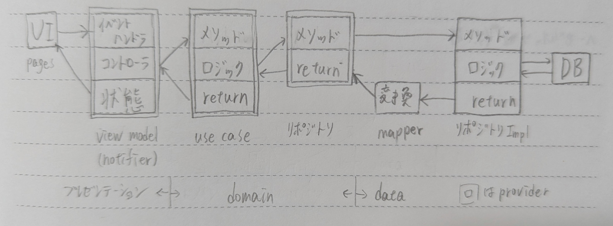

# 翻訳できる単語帳

辞書や単語帳を翻訳に連携させ、英単語と対応する訳の関係を分かりやすく表示するアプリ。

（翻訳画面の画像）
（辞書モーダルを開いた画像）
（単語帳画面の画像）

## 機能

- 検索・ソート・無限スクロールに対応した単語帳
- 単語帳と連携した翻訳
- 英単語をワンタップで辞書検索
- 内部辞書の内容をコピーして単語帳に登録
- 単語帳に登録した英単語を翻訳に使用するかを選択するスイッチ
- 自分好みの訳のまま保存できる英文保存機能
- 英文入力中に変更箇所のみを解析・再描画する軽量な翻訳処理

## 使い方

1. Android: リリースからAPKをダウンロード
2. その他（Windows, Mac, Linux, iOS, Web）: Flutter SDK 導入済みのデバイスで、リポジトリを `clone` し、各の環境向けに `build`

```bash
git clone git@github.com:kokke1302/edb.git
flutter build <platform>
```

その他の内、動作確認済み: Web, Windows11, Linux（Ubuntu 26.04 LTS）

## ファイル構成

```
lib/
├── main.dart           # データベースの初期設定
├── presentation/       # UI・状態管理
│   ├── view_models/   # 画面の状態（Notifier）
│   ├── pages/         # 画面・UIコンポーネント
│   └── root/          # 共通画面・ルーティング
├── domain/                     # ビジネスロジック
│   ├── entity/                # データ構造（Model / Value Object）
│   ├── usecase/               # アプリのユースケース
│   └── repository_abstract/   # リポジトリの抽象クラス
└── data/                  # DBアクセス・データ変換
    ├── repository_impl/   # リポジトリの実装
    ├── mapper/            # DBデータとEntityの相互変換
    └── db/                # データベース（DriftのローカルDB接続設定）
```

## 技術スタック

- フレームワーク: Flutter / Dart
- 状態管理: Riverpod (hooks_riverpod)
- データベース: Drift (SQLite)
- ルーティング: GoRouter (ShellRouteによるUI共通化)
- ロジック: diffutil_dart (英文の差分検出), just_throttle_it (負荷軽減)
- テスト: flutter_test, mocktail

### 依存方向のルール

```
Presentation → Domain ← Data
```

### 処理方向のルール



### テスト方針

- use case層：mocktail で repository をモック化した単体テスト
- repository impl層：DriftのインメモリDBを使った統合テスト

## 使用データ

内部辞書には [EJDict-hand](https://github.com/kujirahand/EJDict)（kujirahand, Public Domain / CC0）を使用しています。

## 責任範囲

本アプリは、プロトタイプの作成、エラー解決のために生成AIを使用しました。
その後、生成されたコードの全文を精読し、以下を自分で実施しています。

- 変数・関数・ID名のリネーム
- UIの追加実装
- ロジックの不具合を修正・改善

リポジトリを構成するファイルは全て制作者が目を通したものです。
コードの品質・動作・不具合に対する責任は制作者が負います。

## 関連ドキュメント

- [開発資料.md](docs/開発資料.md): アプリの開発経緯やコンセプト、こだわり、現在地と今後の開発まで
- [コード現状.md](docs/コード現状.md): データ構造とアーキテクチャ、各クラスの役割等

## ライセンス

MIT [LICENSE](./LICENSE)
