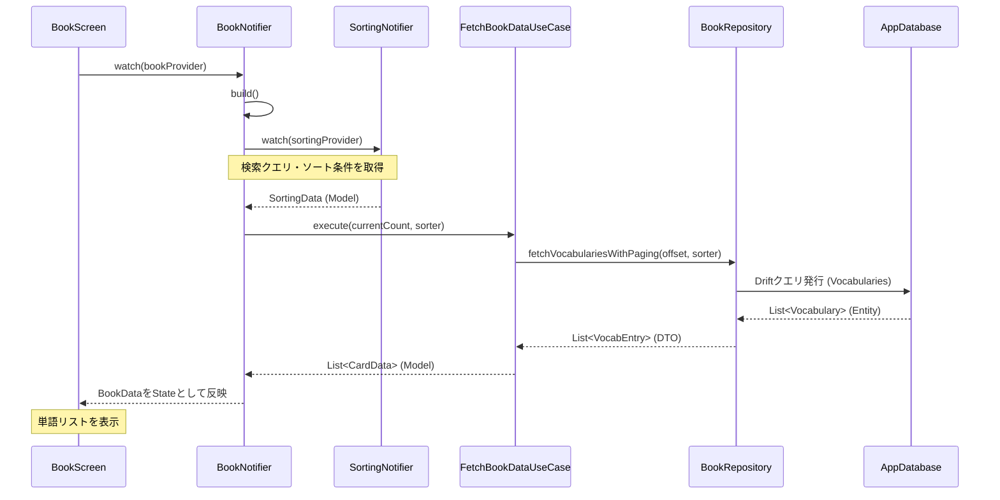
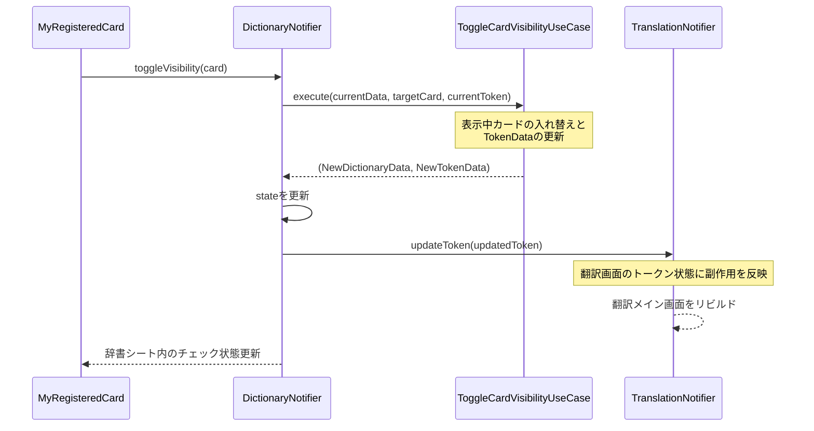

# 開発ガイド

## 本ドキュメントの役割

本ファイルは、開発中アプリプロジェクト内のファイル名と責務を一覧化し、特にAIによる新規機能・修正時のコード重複およびデータ構造不一致を防止することを目的とする。

## 目次

- [開発ガイド](#開発ガイド)
  - [本ドキュメントの役割](#本ドキュメントの役割)
  - [目次](#目次)
  - [アーキテクチャの概要](#アーキテクチャの概要)
    - [各レイヤーの責務](#各レイヤーの責務)
    - [依存方向のルール](#依存方向のルール)
    - [処理方向のルール](#処理方向のルール)
  - [テスト方針](#テスト方針)
    - [テスト対象レイヤー](#テスト対象レイヤー)
    - [テストの分類](#テストの分類)
    - [使用ツール](#使用ツール)
  - [永続化データの定義](#永続化データの定義)
    - [単語帳テーブル（Vocabularies）](#単語帳テーブルvocabularies)
    - [内部辞書テーブル（InternalDictionaries）](#内部辞書テーブルinternaldictionaries)
    - [英文履歴テーブル（EnglishTexts）](#英文履歴テーブルenglishtexts)
  - [ディレクトリ構造](#ディレクトリ構造)
  - [ファイルの責務](#ファイルの責務)
    - [Entity](#entity)
      - [value](#value)
      - [model](#model)
    - [UseCase](#usecase)
    - [RepositoryAbstract](#repositoryabstract)
    - [RepositoryImpl](#repositoryimpl)
    - [Mapper](#mapper)
    - [ViewModel](#viewmodel)
    - [Presentation](#presentation)
      - [wordbook/](#wordbook)
      - [drawer/](#drawer)
      - [translation/](#translation)
      - [register/](#register)
      - [dictionary/](#dictionary)
      - [root/](#root)
    - [DB・main](#dbmain)


## アーキテクチャの概要

本プロジェクトはクリーンアーキテクチャに基づいた設計を行った。
ただし例外として、Provider は RepositoryAbstract ファイル内で定義している。

### 各レイヤーの責務

`presentation/`・`domain/`・`data/` の3レイヤーで構成されている。

- **Presentation層** (pages / view model): UIウィジェットとNotifier。ユーザー操作の受付と画面描画のみを担う。
- **Domain層** (use case / entity / repository): ビジネスロジック、データ定義、Repositoryのインターフェース定義。外部実装に依存しない。
- **Data層** (repository impl / mapper / DB): Repositoryの実装、DBとドメインエンティティ間の変換、Driftの定義。

### 依存方向のルール

```
Presentation → Domain ← Data
```

- Presentationは、DomainのUseCaseとEntityに依存する。
- Domainは、PresentationにもDataにも依存しない。
- Dataは、DomainのRepositoryAbstractを実装し、Entityを返す。

### 処理方向のルール


【制約】状態の競合回避のため

- 他Notifierのプロパティは、Notifierのmain関数でしか取得できない。
- Notifierのメソッドでは、他のNotifierのメソッドは1度しか呼び出すことはできない。

【フロー例】単語帳リスト画面の初期ロード



【フロー例】辞書シートにおける訳語の表示切り替え



## テスト方針

### テスト対象レイヤー

以下の2レイヤーをテストした。

- **UseCase**: ビジネスロジックの正確性。Repositoryをmockして純粋なロジックを検証する。
- **RepositoryImpl**: DBアクセスを含む実装の検証。AppDatabase をmockして動作を確認する。

簡略のため、Presentationレイヤー（Widget/Notifier）はテスト対象外とする。

### テストの分類

各テストケースを以下の3カテゴリで整理する。

- **正常系**: 想定通りのデータが渡された場合に正しい結果が返ること
- **境界値**: ページサイズぴったり・空リスト・文字列長の上限下限など、境界条件での動作
- **異常系**: Repositoryが例外を投げた場合のエラーハンドリング

### 使用ツール

- テストフレームワーク: `flutter_test`
- モックライブラリ: `mocktail`

## 永続化データの定義

### 単語帳テーブル（Vocabularies）

| フィールド名        | 型       | 説明                                                                      |
| :------------------ | :------- | :------------------------------------------------------------------------ |
| id                  | integer  | 主キー、自動インクリメント                                                |
| englishWord         | text     | 英単語（小文字で保存）                                                    |
| japaneseTranslation | text     | 日本語訳                                                                  |
| isHidden            | boolean  | true のとき翻訳に使用しない（ドメイン層では `isShow` として反転して扱う） |
| memo                | text     | ユーザーメモ                                                              |
| created_at          | dateTime | 登録日時                                                                  |
| updated_at          | dateTime | 更新日時                                                                  |

> **排他制御**: `isHidden=false`（表示する）で登録・更新する際、同じ英単語の他の全エントリを `isHidden=true` に更新する。これにより1単語に対して表示される訳語が常に1件以下になる。

### 内部辞書テーブル（InternalDictionaries）

| フィールド名 | 型      | 説明                           |
| :----------- | :------ | :----------------------------- |
| id           | integer | 主キー                         |
| key          | text    | 検索用キー（小文字のみ）       |
| word         | text    | 英単語（表示用、大小文字混合） |
| mean         | text    | 日本語訳                       |
| memo         | text    | メモ（nullable）               |

### 英文履歴テーブル（EnglishTexts）

| フィールド名      | 型       | 説明                                                 |
| :---------------- | :------- | :--------------------------------------------------- |
| id                | integer  | 主キー、自動インクリメント                           |
| original_text     | text     | 元の英文全体                                         |
| parsed_words_json | text     | `TokenData` のリストをJSON形式でシリアライズしたもの |
| created_at        | dateTime | 保存日時                                             |
| updated_at        | dateTime | 更新日時                                             |

## ディレクトリ構造

```
lib/
├── main.dart
├── presentation/
│   ├── view_models/
│   │   ├── book_notifier.dart
│   │   ├── bottom_index_notifier.dart
│   │   ├── dictionary_notifier.dart
│   │   ├── regidata_receiver.dart
│   │   ├── register_notifier.dart
│   │   ├── selected_token_notifier.dart
│   │   ├── sorting_notifier.dart
│   │   ├── tiles_notifier.dart
│   │   └── translation_notifier.dart
│   ├── pages/
│   │   ├── wordbook/
│   │   │   ├── book_screen.dart
│   │   │   ├── list/
│   │   │   │   ├── book_card.dart
│   │   │   │   ├── book_footer.dart
│   │   │   │   └── initial_error.dart
│   │   │   └── search/
│   │   │       ├── searchbar.dart
│   │   │       ├── sort_dropdown.dart
│   │   │       └── sort_order.dart
│   │   ├── drawer/
│   │   │   ├── drawer.dart
│   │   │   └── tile.dart
│   │   ├── translation/
│   │   │   ├── translation.dart
│   │   │   ├── text_field.dart
│   │   │   ├── block_field.dart
│   │   │   ├── word_block.dart
│   │   │   ├── translate_fab.dart
│   │   │   └── bookmark_fab.dart
│   │   ├── register/
│   │   │   ├── registration_page.dart
│   │   │   ├── regi_english_card.dart
│   │   │   ├── regi_translation_card.dart
│   │   │   ├── regi_memo_card.dart
│   │   │   ├── regi_visual_card.dart
│   │   │   └── regi_footer_bar.dart
│   │   └── dictionary/
│   │       ├── dictionary_sheet.dart
│   │       ├── registered_card.dart
│   │       └── dictionary_card.dart
│   └── root/
│       ├── common_screen.dart
│       └── routing.dart
├── domain/
│   ├── entity/
│   │   ├── value/
│   │   │   ├── base_status.dart
│   │   │   ├── sync_status.dart
│   │   │   ├── sort_field.dart
│   │   │   └── sort_order.dart
│   │   └── model/
│   │       ├── book_data.dart
│   │       ├── card_data.dart
│   │       ├── dictionary_data.dart
│   │       ├── sorting_data.dart
│   │       ├── tiles_data.dart
│   │       ├── token_data.dart
│   │       ├── translation_data.dart
│   │       ├── vocab_entry.dart
│   │       ├── token_entry.dart
│   │       ├── tile_data.dart
│   │       └── tile_detail.dart
│   ├── usecase/
│   │   ├── fetch_bookdata_usecase.dart
│   │   ├── fetch_dictionarydata_usecase.dart
│   │   ├── toggle_card_visibility_usucase.dart
│   │   ├── process_translation_usecase.dart
│   │   ├── save_register_usecase.dart
│   │   ├── delete_register_usecase.dart
│   │   ├── fetch_tiles_all_usecase.dart
│   │   ├── fetch_tile_detail_usecase.dart
│   │   ├── save_tile_usecase.dart
│   │   └── delete_tile_usecase.dart
│   └── repository_abstract/
│       ├── book_repository.dart
│       ├── dictionary_repository.dart
│       ├── register_repository.dart
│       ├── token_chain_repository.dart
│       ├── tiles_repository.dart
│       └── translation_repository.dart
└── data/
    ├── repository_impl/
    │   ├── local_book_repository.dart
    │   ├── local_dictionary_repository.dart
    │   ├── local_register_repository.dart
    │   ├── local_token_chain_repository.dart
    │   ├── local_tiles_repository.dart
    │   └── local_translation_repository.dart
    ├── mapper/
    │   ├── vocab_mapper.dart
    │   ├── tile_mapper.dart
    │   └── token_mapper.dart
    └── db/
        ├── app_database.dart
        ├── app_database.g.dart
        ├── database_initializer.dart
        ├── _connection_native.dart
        └── _connection_web.dart
```

## ファイルの責務

### Entity

#### value

- `base_status.dart`
  - `Based` (enum)
    - `vocabularies`: 単語帳DB由来
    - `dictionary`: 内部辞書DB由来
    - `init`: 初期値（未登録）

- `sync_status.dart`
  - `SyncStatus` (enum)
    - `normal`: 通常状態
    - `load`: 途中ロード中
    - `err`: 途中エラー

- `sort_field.dart`
  - `SortField` (enum)
    - `createdAt`: 作成日時でソート
    - `englishWord`: 英単語でソート

- `sort_order.dart`
  - `SortOrder` (enum)
    - `asc`: 昇順
    - `desc`: 降順

#### model

- `book_data.dart`
  - `BookData`
    - `int` pageSize: 1ページあたりの取得件数
    - `List<CardData>` cards: ロード済み単語カードのリスト
    - `SyncStatus` tailStatus: リスト下部に表示すべき状態
    - `bool` isDataEnd (getter): `cards.length < pageSize` でデータ終端かを判定

- `card_data.dart`
  - `CardData`
    - `bool` nowShow: 現在この訳語が翻訳に表示されているか
    - `VocabEntry` vocab: 単語帳エントリ本体（carry層）

- `dictionary_data.dart`
  - `DictionaryData`
    - `CardData`? showCard: 現在選択・表示中のカード（null = 非選択）
    - `List<CardData>` vocabularyCards: 単語帳からの候補リスト（未選択分）
    - `List<CardData>` dictionaryCards: 内部辞書からの候補リスト

- `sorting_data.dart`
  - `SortingData`
    - `SortField` field: ソート対象カラム
    - `SortOrder` order: ソート順
    - `String` searchWord: 確定済み検索文字列
    - `String` typingWord: 入力中の検索文字列（未確定）
    - `int` pageSize: 1ページあたりの取得件数（既定値20）

- `tiles_data.dart`
  - `TilesData`
    - `List<TileData>` list: 保存済み英文履歴リスト

- `token_data.dart`
  - `TokenData`
    - `int` id: リスト内の位置インデックス
    - `int` vocabId: 対応する単語帳エントリID（未登録は -1）
    - `String` showWord: 表示する文字列（大小文字混合）
    - `bool` nowShow: 訳語を翻訳画面に表示するか
    - `String` translation: 表示する訳語
    - `bool` isWord (getter): 単語か句読点かを正規表現で判定
    - `String` word (getter): `showWord.toLowerCase()`（DB検索キー）

- `translation_data.dart`
  - `TranslationData`
    - `String` originalText: 入力された英文全体
    - `List<TokenData>` tokens: トークン化・訳語割り当て済みのリスト

- `vocab_entry.dart`
  - `VocabEntry`
    - `int` id: 単語帳DBのID（内部辞書由来は -1）
    - `String` word: 英単語（小文字）
    - `String` translation: 日本語訳
    - `bool` isShow: 翻訳に使用するか（DBの`isHidden`の反転）
    - `String` memo: メモ
    - `DateTime` createdAt: 登録日時
    - `DateTime` updatedAt: 更新日時
    - `Based` based: 出典元

- `token_entry.dart`
  - `TokenEntry`
    - `int` vocabId: 対応する単語帳エントリID
    - `String` showWord: 英単語（表示用）
    - `String` translation: 日本語訳
    - `bool` isShow: 翻訳に表示するか

- `tile_data.dart`
  - `TileData`
    - `int` id: 英文履歴DBのID
    - `String` text: 英文テキスト（履歴リスト表示用）

- `tile_detail.dart`
  - `TileDetail`
    - `String` title: 英文テキスト
    - `List<TokenData>` chain: 訳語割り当て済みトークンリスト（履歴からの復元用）

### UseCase

- `fetch_bookdata_usecase.dart`
  - `Provider<FetchBookDataUseCase>` bookUseCaseProvider
  - `FetchBookDataUseCase`
    - 依存: `BookRepository`
    - `Future<List<CardData>>` execute({required int currentCount, required SortingData sorter}): ページング・ソート条件で単語リストを取得し、`VocabEntry` → `CardData` に変換して返す
  - Test: `fetch_bookdata_test.dart`
    - 正常系:
      - fetchVocabulariesWithPaging が currentCount を offset に、sorter をそのまま引数に1回呼ばれること
      - 返り値のリスト件数が fetchVocabulariesWithPaging の返り値と一致すること
      - 各 CardData の vocab が対応する VocabEntry と一致すること
      - 各 CardData の nowShow が対応する VocabEntry の isShow と一致すること
      - fetchVocabulariesWithPaging が空リストを返したとき、空リストが返ること
    - 境界値:
      - （なし）
    - 異常系:
      - fetchVocabulariesWithPaging が Exception をthrowしたとき、usecase もそのまま投げること

- `fetch_dictionarydata_usecase.dart`
  - `Provider<FetchDictionaryDataUseCase>` dictionaryUseCaseProvider
  - `FetchDictionaryDataUseCase`
    - 依存: `DictionaryRepository`
    - `Future<DictionaryData>` execute(TokenData token): 単語帳・内部辞書の両方から訳語候補を取得し、`showCard`/`vocabularyCards`/`dictionaryCards` に振り分けた `DictionaryData` を返す
  - Test: `fetch_dictionary_data_test.dart`
    - 正常系:
      - fetchVocabularies と fetchDictionaries が token.word を引数に1回ずつ呼ばれること
      - token.nowShow が true かつ vocabId と一致する VocabEntry が存在するとき、showCard が設定され nowShow が true、その他は false になること
      - token.nowShow が false のとき、showCard が null になり、vocabularyCards の nowShow がすべて false になること
      - token.nowShow が true でも vocabId と一致する VocabEntry が存在しないとき、showCard が null になること
      - dictionaryCards が fetchDictionaries の返り値を CardData に変換したリストと一致すること
      - fetchVocabularies が空リストを返したとき、showCard が null で vocabularyCards が空リストになること
      - fetchDictionaries が空リストを返したとき、dictionaryCards が空リストになること
    - 境界値:
      - （なし）
    - 異常系:
      - fetchVocabularies が Exception をthrowしたとき、usecase もそのまま投げること
      - fetchDictionaries が Exception をthrowしたとき、usecase もそのまま投げること

- `toggle_card_visibility_usucase.dart`
  - `Provider<ToggleCardVisibilityUseCase>` toggleCardVisibilityUseCaseProvider
  - `ToggleCardVisibilityUseCase`
    - 依存: なし（純粋ロジック）
    - `(DictionaryData, TokenData)` execute({required DictionaryData currentData, required CardData targetCard, required TokenData currentToken}): `showCard` と `vocabularyCards` の入れ替えと `TokenData` の更新を行い、新しい状態をタプルで返す
  - Test: `toggle_card_visibility_test.dart`
    - 正常系:
      - targetCard が showCard と同じ id のとき、新しい showCard が null になること
      - そのとき targetCard が nowShow: false で vocabularyCards に追加されること
      - currentData.showCard が null のとき、targetCard が nowShow: true で新しい showCard に設定されること
      - そのとき targetCard が vocabularyCards から取り除かれること
      - currentData.showCard が存在するとき、既存の showCard が nowShow: false で vocabularyCards に追加されること
      - そのとき targetCard が nowShow: true で新しい showCard に設定され vocabularyCards から取り除かれること
      - リストからカード選択時、currentToken の vocabId と translation が targetCard の内容で上書きされること
    - 境界値:
      - （なし）
    - 異常系:
      - targetCard の id が vocabularyCards にも showCard にも存在しないとき、currentData と currentToken がそのまま返ること

- `process_translation_usecase.dart`
  - `Provider<ProcessTranslationUseCase>` processtranslationUseCaseProvider
  - `ProcessTranslationUseCase`
    - 依存: `TranslationRepository`
    - `Future<List<TokenData>>` execute({required String text, required List<TokenData> currentTokens, required bool isFullScan}): `isFullScan` が true なら全体翻訳、false なら差分翻訳を実行し、訳語割り当て済みトークンリストを返す
  - Test: `process_transelation_test.dart`
    - 正常系:
      - text が空文字のとき、空リストが返ること
      - text が空文字のとき、fullTranslation も partTranslation も呼ばれないこと
      - fullTranslation が text を引数に1回呼ばれること（isFullScan が true）
      - partTranslation が呼ばれないこと（isFullScan が true）
      - fullTranslation の返り値がそのまま返ること（isFullScan が true）
      - partTranslation が currentTokens と text を引数に1回呼ばれること（isFullScan が false）
      - fullTranslation が呼ばれないこと（isFullScan が false）
      - partTranslation の返り値がそのまま返ること（isFullScan が false）
    - 境界値:
      - （なし）
    - 異常系:
      - fullTranslation が Exception をthrowしたとき、usecase もそのまま投げること
      - partTranslation が Exception をthrowしたとき、usecase もそのまま投げること

- `save_register_usecase.dart`
  - `Provider<SaveRegisterUseCase>` saveRegisterUseCaseProvider
  - `SaveRegisterUseCase`
    - 依存: `RegisterRepository`
    - `Future<TokenData>` execute({required CardData card, required TokenData token}): `Based` に応じて新規登録または更新を行い、更新後の `TokenData` を返す
  - Test: `save_register_test.dart`
    - 正常系:
      - addVocabulary が card.vocab を引数に1回呼ばれること（based が vocabularies 以外）
      - updateVocabulary が呼ばれないこと（based が vocabularies 以外）
      - 返り値の vocabId が addVocabulary の返り値の id になること
      - 返り値の nowShow が card.nowShow になること
      - 元の TokenData の id / showWord / translation が変わらないこと
      - updateVocabulary が card.vocab を引数に1回呼ばれること（based が vocabularies）
      - addVocabulary が呼ばれないこと（based が vocabularies）
      - 返り値の vocabId が updateVocabulary の返り値の id になること
    - 境界値:
      - （なし）
    - 異常系:
      - addVocabulary が Exception をthrowしたとき、usecase もそのまま投げること
      - updateVocabulary が Exception をthrowしたとき、usecase もそのまま投げること

- `delete_register_usecase.dart`
  - `Provider<DeleteRegisterUseCase>` deleteRegisterUseCaseProvider
  - `DeleteRegisterUseCase`
    - 依存: `RegisterRepository`
    - `Future<TokenData>` execute({required CardData card, required TokenData token}): DBから単語を削除し、vocabIdをリセットした `TokenData` を返す
  - Test: `delete_register_test.dart`
    - 正常系:
      - deleteVocabulary が card.vocab.id を引数に1回呼ばれること
      - 返り値の vocabId が -1 になること
      - 返り値の nowShow が false になること
      - 元の TokenData の id / showWord / translation が変わらないこと
    - 境界値:
      - （なし）
    - 異常系:
      - deleteVocabulary が Exception をthrowしたとき、usecase もそのまま投げること

- `fetch_tiles_all_usecase.dart`
  - `Provider<FetchAllTilesUseCase>` fetchAllTilesUseCaseProvider
  - `FetchAllTilesUseCase`
    - 依存: `TilesRepository`
    - `Future<List<TileData>>` execute(): 全英文履歴を取得する
  - Test: `fetch_tiles_all_test.dart`
    - 正常系:
      - fetchAllTiles が1回呼ばれること
      - fetchAllTiles の返り値がそのまま返ること
      - fetchAllTiles が空リストを返したとき、空リストが返ること
    - 境界値:
      - （なし）
    - 異常系:
      - fetchAllTiles が Exception をthrowしたとき、usecase もそのまま投げること

- `fetch_tile_detail_usecase.dart`
  - `Provider<FetchTileDetailUseCase>` fetchTileDetailUseCaseProvider
  - `FetchTileDetailUseCase`
    - 依存: `TilesRepository`
    - `Future<TileDetail>` execute({required int id}): 指定IDの英文履歴をトークンチェーンごと取得する
  - Test: `fetch_tile_detail_test.dart`
    - 正常系:
      - fetchTileDetail が指定した id を引数に1回呼ばれること
      - fetchTileDetail の返り値がそのまま返ること
    - 境界値:
      - （なし）
    - 異常系:
      - fetchTileDetail が Exception をthrowしたとき、usecase もそのまま投げること

- `save_tile_usecase.dart`
  - `Provider<SaveTileUseCase>` saveTileUseCaseProvider
  - `SaveTileUseCase`
    - 依存: `TilesRepository`
    - `Future<TileData>` execute({required String originalText, required List<TokenData> tokens}): トークンリストをJSONシリアライズしてDBに保存し、新しい `TileData` を返す
  - Test: `save_tile_test.dart`
    - 正常系:
      - createTile が originalText と tokens を JSON エンコードした文字列を引数に1回呼ばれること
      - tokens の各要素が toJson() で変換されて chain に含まれていること
      - 返り値の id が createTile の返り値になること
      - 返り値の text が originalText になること
    - 境界値:
      - （なし）
    - 異常系:
      - createTile が Exception をthrowしたとき、usecase もそのまま投げること

- `delete_tile_usecase.dart`
  - `Provider<DeleteTileUseCase>` deleteTileUseCaseProvider
  - `DeleteTileUseCase`
    - 依存: `TilesRepository`
    - `Future<void>` execute({required int id}): 指定IDの英文履歴を削除する
  - Test: `delete_tile_test.dart`
    - 正常系:
      - deleteTile が指定した id を引数に1回呼ばれること
      - 正常終了すること（例外が投げられないこと）
    - 境界値:
      - （なし）
    - 異常系:
      - deleteTile が Exception をthrowしたとき、usecase もそのまま投げること


### RepositoryAbstract

各ファイルには `abstract interface class` の定義と、対応する `Provider` の定義が同居する。Providerの実装クラスインスタンスを生成することが、Data層に依存する唯一の箇所。

- `book_repository.dart`
  - `Provider<BookRepository>` bookRepositoryProvider
  - `BookRepository` (abstract)
    - `Future<List<VocabEntry>>` fetchVocabulariesWithPaging({required int offset, required SortingData sorter}): ソート・検索・ページングを適用して単語リストを取得

- `dictionary_repository.dart`
  - `Provider<DictionaryRepository>` dictionaryRepositoryProvider
  - `DictionaryRepository` (abstract)
    - `Future<List<VocabEntry>>` fetchVocabularies({required String word}): 単語帳DBから特定単語の全訳語を取得
    - `Future<List<VocabEntry>>` fetchDictionaries({required String word}): 内部辞書DBから特定単語の訳語を取得

- `register_repository.dart`
  - `Provider<RegisterRepository>` registerRepositoryProvider
  - `RegisterRepository` (abstract)
    - `Future<VocabEntry>` addVocabulary({required VocabEntry vocab}): 単語を新規追加し、登録後エントリを返す
    - `Future<VocabEntry>` updateVocabulary({required VocabEntry vocab}): 単語を更新し、更新後エントリを返す
    - `Future<void>` deleteVocabulary({required int id}): 指定IDの単語を削除する

- `token_chain_repository.dart`
  - `Provider<TokenChainRepository>` tokenChainRepositoryProvider
  - `TokenChainRepository` (abstract)
    - `Future<Set<TokenEntry>>` fetchTokenChain(Set<String> words): 複数の単語キーに対する単語帳エントリを一括取得する

- `tiles_repository.dart`
  - `Provider<TilesRepository>` tilesRepositoryProvider
  - `TilesRepository` (abstract)
    - `Future<int>` createTile({required String text, required String chain}): 英文履歴を保存し、発行されたIDを返す
    - `Future<List<TileData>>` fetchAllTiles(): 全英文履歴の軽量リストを取得する
    - `Future<TileDetail>` fetchTileDetail({required int id}): 指定IDの英文履歴をトークンチェーンごと取得する
    - `Future<void>` deleteTile({required int id}): 指定IDの英文履歴を削除する

- `translation_repository.dart`
  - `Provider<TranslationRepository>` translationRepositoryProvider
  - `TranslationRepository` (abstract)
    - `Future<List<TokenData>>` partTranslation({required List<TokenData> nowTokens, required String newText}): 差分検出による部分的な翻訳更新を行う
    - `Future<List<TokenData>>` fullTranslation({required String text}): テキスト全体を再トークン化して翻訳する


### RepositoryImpl

- `local_book_repository.dart`
  - `LocalBookRepository` implements `BookRepository`
    - 保有: `AppDatabase`
    - `fetchVocabulariesWithPaging`: 検索・ソート・ページング条件をDriftクエリに動的適用し、`VocabMapper`で変換して返す
  - Test: `local_book_test.dart`
    - 正常系:
      - 返り値のリスト件数が DB の行数と一致すること
      - 各 VocabEntry の word / translation / memo / isShow が DB の該当行と一致すること
      - DB が空のとき、空リストが返ること
    - 境界値:
      - searchWord が空文字のとき、全件取得されること
      - searchWord が englishWord に部分一致する行だけ返ること
      - searchWord が japaneseTranslation に部分一致する行だけ返ること
      - searchWord が memo に部分一致する行だけ返ること
      - searchWord がいずれのカラムにも一致しないとき、空リストが返ること
      - SortField.englishWord / SortOrder.asc のとき、英単語の昇順で返ること
      - SortField.englishWord / SortOrder.desc のとき、英単語の降順で返ること
      - SortField.createdAt / SortOrder.asc のとき、作成日時の昇順で返ること
      - SortField.createdAt / SortOrder.desc のとき、作成日時の降順で返ること
      - offset が 0 のとき、先頭から pageSize 件返ること
      - offset が pageSize と同じ値のとき、次のページが返ること
      - offset が総件数以上のとき、空リストが返ること
      - pageSize より DB の行数が少ないとき、存在する行数だけ返ること
    - 異常系:
      - DB 接続が失敗した状態で呼んだとき、Exception が投げられること（※Drift in-memory DB では未検証）

- `local_dictionary_repository.dart`
  - `LocalDictionaryRepository` implements `DictionaryRepository`
    - 保有: `AppDatabase`
    - `fetchVocabularies`: 単語帳テーブルから対象単語を検索し、`VocabMapper.fromVocabularies`で変換
    - `fetchDictionaries`: 内部辞書テーブルから対象単語を検索し、`VocabMapper.fromDictionary`で変換
  - Test: `local_dictionary_test.dart`
    - 正常系:
      - englishWord が word と完全一致する行だけ返ること
      - 返り値の word / translation / memo / isShow が DB の該当行と一致すること
      - isHidden が true の行の isShow が false にマッピングされること
      - isHidden が false の行の isShow が true にマッピングされること
      - 返り値の based がすべて Based.vocabularies になること
      - 同じ word に複数行存在するとき、全件返ること
      - 該当行が存在しないとき、空リストが返ること
      - key が word と完全一致する行だけ返ること（fetchDictionaries）
      - 返り値の id がすべて -1 になること
      - 返り値の isShow がすべて true になること
      - 返り値の based がすべて Based.dictionary になること
      - memo が null の行の memo が空文字にマッピングされること
    - 境界値:
      - word の大文字・小文字が混在していても一致する行が返ること（fetchVocabularies）
      - key の大文字・小文字が混在していても一致する行が返ること（fetchDictionaries）
    - 異常系:
      - DB 接続が失敗した状態で fetchVocabularies を呼んだとき、Exception が投げられること（※Drift in-memory DB では未検証）
      - DB 接続が失敗した状態で fetchDictionaries を呼んだとき、Exception が投げられること（※Drift in-memory DB では未検証）

- `local_register_repository.dart`
  - `LocalRegisterRepository` implements `RegisterRepository`
    - 保有: `AppDatabase`
    - `addVocabulary`: `isShow=true` の場合、同単語の他エントリを `isHidden=true` にする排他制御後に挿入。`insertReturning` で登録後行を返す
    - `updateVocabulary`: 同様の排他制御後に更新。`writeReturning` で更新後行を返す
    - `deleteVocabulary`: 指定IDの行を削除
  - Test: `local_register_test.dart`
    - 正常系:
      - 返り値の word / translation / memo が vocab と一致すること（addVocabulary）
      - 返り値の id が自動採番された正の整数になること
      - 挿入後に DB に該当行が存在すること
      - 返り値の word / translation / memo / isHidden が更新内容と一致すること（updateVocabulary）
      - 更新後に DB の該当行が新しい内容になっていること
      - 削除後に同じ id で取得しても該当行が存在しないこと（deleteVocabulary）
    - 境界値:
      - vocab.isShow が true のとき、同じ word を持つ既存エントリの isHidden が true に更新されること（addVocabulary）
      - vocab.isShow が false のとき、既存エントリの isHidden が変更されないこと（addVocabulary）
      - vocab.isShow が true のとき、同じ word を持つ既存エントリの isHidden が true に更新されること（updateVocabulary）
      - vocab.isShow が false のとき、既存エントリの isHidden が変更されないこと（updateVocabulary）
      - 存在しない id を指定しても例外が投げられないこと（deleteVocabulary）
    - 異常系:
      - DB 接続が失敗した状態で addVocabulary を呼んだとき、Exception が投げられること（※Drift in-memory DB では未検証）
      - DB 接続が失敗した状態で updateVocabulary を呼んだとき、Exception が投げられること（※Drift in-memory DB では未検証）
      - DB 接続が失敗した状態で deleteVocabulary を呼んだとき、Exception が投げられること（※Drift in-memory DB では未検証）

- `local_token_chain_repository.dart`
  - `LocalTokenChainRepository` implements `TokenChainRepository`
    - 保有: `AppDatabase`
    - `fetchTokenChain`: 複数単語キーに対する単語帳エントリを一括取得。`isHidden=false` のエントリのみ対象
  - Test: `local_token_chain_test.dart`
    - 正常系:
      - lookupKeys に一致する englishWord を持つ行のみ返ること
      - 返り値の vocabId / showWord / translation が DB の該当行と一致すること
      - isHidden が true の行は返り値に含まれないこと
      - isHidden が false の行の isShow が true にマッピングされること
      - lookupKeys に複数のキーを渡したとき、一致する全行が返ること
      - 一致する行が存在しないとき、空の Set が返ること
    - 境界値:
      - lookupKeys が空 Set のとき、DB を参照せず空の Set が返ること
      - lookupKeys の文字列が大文字混じりでも、小文字で登録済みの行が返ること
      - lookupKeys に含まれないキーを持つ行が DB に存在しても、返り値に含まれないこと
    - 異常系:
      - DB 接続が失敗した状態で呼んだとき、Exception が投げられること（※Drift in-memory DB では未検証）

- `local_tiles_repository.dart`
  - `LocalTilesRepository` implements `TilesRepository`
    - 保有: `AppDatabase`
    - `createTile`: 英文とJSONトークンチェーンをDBに挿入し、IDを返す
    - `fetchAllTiles`: 全英文履歴を `TileMapper.toTileData` で変換して返す
    - `fetchTileDetail`: 指定IDの行をJSONデシリアライズして `TileDetail` に変換して返す
    - `deleteTile`: 指定IDの行を削除
  - Test: `local_tiles_test.dart`
    - 正常系:
      - 返り値が正の整数の id になること（createTile）
      - 挿入後に DB に該当行が存在すること
      - 挿入された行の originalText / parsedWordsJson が引数と一致すること
      - 返り値のリスト件数が DB の行数と一致すること（fetchAllTiles）
      - 各 TileData の id / text が DB の該当行と一致すること
      - DB が空のとき、空リストが返ること
      - 指定した id の行の内容が返ること（fetchTileDetail）
      - 削除後に同じ id の行が DB に存在しないこと（deleteTile）
      - 返り値が 1（削除件数）になること
    - 境界値:
      - 存在しない id を指定したとき、返り値が 0 になること（deleteTile）
    - 異常系:
      - 存在しない id を指定したとき、Exception が投げられること（fetchTileDetail）

- `local_translation_repository.dart`
  - `LocalTranslationRepository` implements `TranslationRepository`
    - 保有: `TokenChainRepository`（DB接続の代わり）
    - `_tokenizeText`: 正規表現でテキストをトークン分割する内部メソッド（空白除去、ハイフン・アポストロフィ単語対応）
    - `partTranslation`: `diffutil_dart` で差分を検出し、変更箇所のみDB検索して訳語を更新する
    - `fullTranslation`: 全トークンを再生成し、一括でDB検索して訳語を割り当てる
  - Test: `local_translation_test.dart`
    - 正常系:
      - 通常の英単語がトークンに分割されること（fullTranslation）
      - ハイフン単語が 1 トークンになること
      - アポストロフィ単語が 1 トークンになること
      - 句読点が独立したトークンになること
      - 空白のみのトークンが無視されること
      - DB に登録済みの単語に vocabId / translation / nowShow が反映されること
      - DB に未登録の単語の vocabId / translation が初期値のままになること
      - 句読点トークンの vocabId / translation が初期値のままになること
      - 各トークンの id が 0 始まりの連番になること
      - newText が nowTokens と同じ内容のとき、既存トークンがそのまま返ること（partTranslation）
      - 末尾に単語が追加されたとき、新しいトークンが末尾に挿入されること
      - 追加されたトークンに DB の翻訳が反映されること
      - 追加時に既存トークンの vocabId / translation / nowShow が変わらないこと
      - 末尾の単語が削除されたとき、該当トークンが取り除かれること
      - 既存トークンの単語が別の単語に変わったとき、新しい翻訳が反映されること
      - 変更されていないトークンの vocabId / translation / nowShow が変わらないこと
      - 差分適用後の全トークンの id が 0 始まりの連番になること
    - 境界値:
      - 大文字・小文字が混在するテキストでも DB のエントリが反映されること（fullTranslation）
      - 重複する単語があっても fetchTokenChain に渡されるキーが重複しないこと
      - 差分なしのとき fetchTokenChain が空 Set で呼ばれること（partTranslation）
      - 削除のみで affectedIndices が空のとき fetchTokenChain が空 Set で呼ばれること
    - 異常系:
      - fetchTokenChain が Exception を throw したとき、そのまま投げること


### Mapper

- `vocab_mapper.dart`
  - `VocabMapper`
    - `VocabEntry` fromVocabularies({required Vocabulary vocabulary}): 単語帳DBエンティティ → `VocabEntry` に変換。`isHidden` を反転して `isShow` にする
    - `VocabEntry` fromDictionary({required InternalDictionary dictionary}): 内部辞書DBエンティティ → `VocabEntry` に変換。`id=-1`・`based=Based.dictionary` を付与

- `tile_mapper.dart`
  - `TileMapper`
    - `TileData` toTileData({required int id, required String text}): ID とテキストから軽量DTOを生成
    - `TileDetail` toTileDetail({required EnglishText et}): DBエンティティのJSONフィールドをデシリアライズし、`TokenMapper`を使って `TileDetail` に変換

- `token_mapper.dart`
  - `TokenMapper`
    - `TokenData` fromJson(Map<String, dynamic> json): JSON → `TokenData` に変換（英文履歴の復元用）


### ViewModel

- `book_notifier.dart`
  - `AsyncNotifierProvider.autoDispose<BookNotifier, BookData>` bookProvider
  - `BookNotifier`
    - 依存UseCase: `FetchBookDataUseCase`
    - 依存ViewModel: `sortingProvider`（検索・ソート条件の変化を監視し、自動リロード）
    - 保有State: `BookData`
    - `Future<BookData>` build(): `sortingProvider` を `watch` して初期ページをロード
    - `Future<void>` loadNextPage(): 次ページを取得して `cards` に追記
    - `Future<void>` reload(): Stateをリセットして最初のページから再取得

- `dictionary_notifier.dart`
  - `AsyncNotifierProvider.autoDispose<DictionaryNotifier, DictionaryData>` dictionaryProvider
  - `DictionaryNotifier`
    - 依存UseCase: `FetchDictionaryDataUseCase`・`ToggleCardVisibilityUseCase`
    - 依存ViewModel: `selectedTokenProvider`・`translationProvider`
    - 保有State: `DictionaryData`
    - `Future<DictionaryData>` build(): 選択中トークンの訳語候補を取得
    - `Future<void>` toggleVisibility({required CardData card}): 訳語の表示切り替えを行い、`translationProvider` にも反映（副作用）

- `register_notifier.dart`
  - `AsyncNotifierProvider.autoDispose<RegisterNotifier, CardData>` registerProvider
  - `RegisterNotifier`
    - 依存UseCase: `SaveRegisterUseCase`・`DeleteRegisterUseCase`
    - 依存ViewModel: `regiDataReceiver`（初期データ受け取り）・`bookProvider`・`translationProvider`・`selectedTokenProvider`
    - 保有State: `CardData`
    - `Future<CardData>` build(): `regiDataReceiver` から初期状態をロード
    - `void` updateEnglish / updateTranslation / updateMemo / toggleIsShowing: 各フィールドを更新
    - `Future<void>` save(): バリデーション後に保存/更新し、関連Providerを更新
    - `Future<void>` delete(): DBから削除し、関連Providerを更新

- `regidata_receiver.dart`
  - `NotifierProvider<RegiDataReceiver, CardData>` regiDataReceiver
  - `RegiDataReceiver`
    - 保有State: `CardData`（登録画面への渡し値）
    - `CardData` build(): 空の初期状態
    - `void` initialCard({String word}): 新規作成（空カード）として初期化
    - `void` receiveRegisteredCard({required CardData card}): 単語帳カードから編集開始
    - `void` receiveDictionaryCard({required CardData card}): 内部辞書カードから登録開始

- `selected_token_notifier.dart`
  - `NotifierProvider<SelectedTokenNotifier, TokenData>` selectedTokenProvider
  - `SelectedTokenNotifier`
    - 保有State: `TokenData`（辞書シートを開いているトークン）
    - `TokenData` build(): 空の初期状態
    - `void` selsectNew({required TokenData token}): 選択トークンを更新

- `sorting_notifier.dart`
  - `NotifierProvider<SortingNotifier, SortingData>` sortingProvider
  - `SortingNotifier`
    - 保有State: `SortingData`
    - `SortingData` build(): デフォルト設定（englishWord / desc）
    - `void` setField / setOrder / setSearchWord / setTypeWord: 各設定を更新（`bookProvider` が `watch` しているため変更時に自動リロード）

- `tiles_notifier.dart`
  - `AsyncNotifierProvider.autoDispose<TilesNotifier, TilesData>` tilesProvider
  - `TilesNotifier`
    - 依存UseCase: `FetchAllTilesUseCase`・`SaveTileUseCase`・`DeleteTileUseCase`・`FetchTileDetailUseCase`
    - 依存ViewModel: `translationProvider`
    - 保有State: `TilesData`
    - `Future<TilesData>` build(): 全英文履歴をロード
    - `Future<void>` addTile(): 現在の翻訳状態をDBに保存し、リストに追加
    - `Future<void>` deleteTile({required int id}): DBから削除し、リストから除去
    - `Future<void>` makeTokenChain({required int id}): 履歴詳細を取得し `translationProvider` に復元

- `translation_notifier.dart`
  - `AsyncNotifierProvider<TranslationNotifier, TranslationData>` translationProvider
  - `Provider.family.autoDispose<TokenData, int>` tokenProvider（index指定で特定トークンを参照）
  - `TranslationNotifier`
    - 依存UseCase: `ProcessTranslationUseCase`
    - 保有State: `TranslationData`
    - `TranslationData` build(): 空の初期状態
    - `void` restore({required String text, required List<TokenData> chain}): 英文履歴から翻訳状態を復元
    - `void` updateToken({required TokenData updatedToken}): 特定トークンの訳語を更新（辞書シートからの変更反映）
    - `void` updateOriginalText({required String newText}): 英文入力の更新。Throttleで差分翻訳をトリガー
    - `void` pushTriggerButton(): 手動翻訳ボタン。全体翻訳を実行
    - `void` _runTranslation({required bool isFullScan}): 翻訳処理メインロジック（ProcessTranslationUseCaseを呼び出す）

- `bottom_index_notifier.dart`
  - `NotifierProvider<BottomNavIndexNotifier, int>` bottomNavIndexProvider
  - `BottomNavIndexNotifier`
    - 保有State: `int`（ボトムナビの現在インデックス）
    - `int` build(): 初期値 0
    - `void` setIndex(int newIndex): インデックスを更新


### Presentation

#### wordbook/

- `book_screen.dart`
  - 依存ViewModel: `bookProvider`・`sortingProvider`・`regiDataReceiver`
  - 表示内容
    - SliverAppBar（floating/snap）: 検索バー（`MySearchBar`）、ソートドロップダウン（`MySortDropdownMenu`）、ソート順ボタン（`MySortOrderButton`）、ホームボタン、リロードボタンを内包
    - Body: `bookProvider` の AsyncValue に応じて初回ロード中 / 初回エラー / データありを切り替え
    - リスト表示時: `SliverList` で `MyBookCard` と `MyBookFooter` を描画。`useEffect` で無限スクロールを設定し、`Throttle`で連続発火を防止
    - FAB（右下）: 新規単語追加ボタン。`regiDataReceiver.initialCard()` 後に `/registration` へ遷移
  - 子UIファイル
    - `list/book_card.dart`・`list/book_footer.dart`・`list/initial_error.dart`
    - `search/searchbar.dart`・`search/sort_dropdown.dart`・`search/sort_order.dart`

- `list/book_card.dart` (`MyBookCard`)
  - 依存ViewModel: なし（`CardData` をプロパティで受け取る）
  - 表示内容: 単語リストの1項目。英単語・日本語訳（上段）、メモ・isShow状態・更新日時（下段）を表示

- `list/book_footer.dart` (`MyBookFooter`)
  - 依存ViewModel: `bookProvider`
  - 表示内容: `tailStatus` に応じて途中ロード中インジケータ / エラーとリトライボタン / リスト終端メッセージを切り替え

- `list/initial_error.dart` (`MyInitialError`)
  - 依存ViewModel: `bookProvider`
  - 表示内容: 初回ロード失敗時にエラーメッセージとリトライボタンを表示

- `search/searchbar.dart` (`MySearchBar`)
  - 依存ViewModel: `sortingProvider`
  - 表示内容: 検索文字列入力フィールド。入力中は `setTypeWord`、確定時は `setSearchWord` を呼び出す

- `search/sort_dropdown.dart` (`MySortDropdownMenu`)
  - 依存ViewModel: `sortingProvider`
  - 表示内容: `SortField` を選択するドロップダウンメニュー

- `search/sort_order.dart` (`MySortOrderButton`)
  - 依存ViewModel: `sortingProvider`
  - 表示内容: `SortOrder` を切り替えるボタン（上下矢印アイコン）

#### drawer/

- `drawer.dart` (`MyDrawer`)
  - 依存ViewModel: `tilesProvider`
  - 表示内容
    - ヘッダー: 「保存した英文」タイトル
    - リスト: `tilesProvider` を監視して `MyTile` のリストを表示。ロード中・エラー時はそれぞれ切り替え
    - フッター: 設定・ヘルプへのListTile
  - 子UIファイル: `tile.dart`

- `tile.dart` (`MyTile`)
  - 依存ViewModel: `tilesProvider`
  - 表示内容
    - 中央: 英文テキスト。タップで `tilesProvider.makeTokenChain(id)` を呼び出し翻訳画面に復元、ドロワーを閉じる
    - 右: 削除ボタン。タップで `tilesProvider.deleteTile(id)` を呼び出す

#### translation/

- `translation.dart` (`MyTranslationPage`)
  - 依存ViewModel: なし（子ウィジェットに委譲）
  - 表示内容: 英文入力エリア、FABボタン群、ブロック表示エリアを縦に配置
  - 子UIファイル: `text_field.dart`・`block_field.dart`・`translate_fab.dart`・`bookmark_fab.dart`

- `text_field.dart` (`MyTextField`)
  - 依存ViewModel: `translationProvider`
  - 表示内容: 英文入力 `TextField`。テキスト変更時に `updateOriginalText` を呼び差分翻訳をトリガー。クリアボタン付き

- `block_field.dart` (`MyBlockField`)
  - 依存ViewModel: `translationProvider`
  - 表示内容: `tokens` を `Wrap` でブロック表示。ピリオド後に改行を挿入。翻訳処理中は `CircularProgressIndicator` を表示
  - 子UIファイル: `word_block.dart`

- `word_block.dart` (`MyWordBlock`)
  - 依存ViewModel: `tokenProvider`（indexで特定トークンを参照）・`selectedTokenProvider`
  - 表示内容
    - 上段: 英単語を表示
    - 下段: `nowShow` に応じて日本語訳を表示/非表示
    - タップ: `selectedTokenProvider.selsectNew(token)` 後、辞書シート（`MyVocabularyInputSheet`）をモーダル表示
  - 子UIファイル: `dictionary/dictionary_sheet.dart`

- `translate_fab.dart` (`MyTranslateFab`)
  - 依存ViewModel: `translationProvider`
  - 表示内容: 手動翻訳FAB。`isLoading` 時は `Icons.loop`、それ以外は `Icons.play_arrow` を表示。タップで `pushTriggerButton` を呼び出す

- `bookmark_fab.dart` (`MyBookmarkFab`)
  - 依存ViewModel: `tilesProvider`
  - 表示内容: 英文保存FAB。タップで `tilesProvider.addTile()` を呼び出す

#### register/

- `registration_page.dart` (`MyEntryPage`)
  - 依存ViewModel: `registerProvider`
  - 表示内容
    - AppBar: `based` に応じて「カードを編集」/「カードを作成」のタイトルを表示
    - Body: 4つの入力カードを `SingleChildScrollView` 内に配置
    - フッターバー: `Stack` で最前面に固定
  - 子UIファイル: `regi_english_card.dart`・`regi_translation_card.dart`・`regi_memo_card.dart`・`regi_visual_card.dart`・`regi_footer_bar.dart`

- `regi_english_card.dart` (`MyEnglishCard`)
  - 依存ViewModel: `registerProvider`
  - 表示内容: 新規登録時は英単語入力 `TextField`、編集時は英単語テキストと「編集」ボタン（タップで警告ダイアログ → `TextField` に切り替え）

- `regi_translation_card.dart` (`MyTranslationCard`)
  - 依存ViewModel: `registerProvider`
  - 表示内容: 日本語訳入力 `TextField`（必須）。変更時に `updateTranslation` を呼び出す

- `regi_memo_card.dart` (`MyMemoCard`)
  - 依存ViewModel: `registerProvider`
  - 表示内容: メモ入力 `TextField`。変更時に `updateMemo` を呼び出す

- `regi_visual_card.dart` (`MyVisibilitySwitchCard`)
  - 依存ViewModel: `registerProvider`
  - 表示内容: 訳語の表示/非表示を切り替えるスイッチ。`isShow` に応じてテキストとアイコンを切り替え

- `regi_footer_bar.dart` (`MyFooterBar`)
  - 依存ViewModel: `registerProvider`
  - 表示内容
    - 削除ボタン: 新規作成時は非表示。編集時のみ表示。タップで `registerProvider.delete()` 後に `context.pop()`
    - キャンセルボタン: タップで `context.pop()`
    - 保存ボタン: 処理中・訳語空・英語空（新規時）の場合は無効化。タップで `registerProvider.save()` 後に `context.pop()`

#### dictionary/

- `dictionary_sheet.dart` (`MyVocabularyInputSheet`)
  - 依存ViewModel: `dictionaryProvider`・`selectedTokenProvider`・`regiDataReceiver`
  - 表示内容
    - ヘッダー: 選択中トークンの英単語を表示
    - `showCard` エリア: 現在選択中のカード（`MyRegisteredCard`）を表示
    - 単語帳候補リスト: `vocabularyCards` を `MyRegisteredCard` で列挙
    - 内部辞書候補リスト: `dictionaryCards` を `MyDictionaryCard` で列挙
    - 最下部: 「オリジナル訳語を登録」ListTile。タップで `regiDataReceiver.initialCard(word)` 後に `/registration` へ遷移
  - 子UIファイル: `registered_card.dart`・`dictionary_card.dart`

- `registered_card.dart` (`MyRegisteredCard`)
  - 依存ViewModel: `dictionaryProvider`・`regiDataReceiver`
  - 表示内容
    - 左: 訳語テキスト
    - 右（目のアイコン）: `dictionaryProvider.toggleVisibility(card)` を呼び出し
    - 右（本のアイコン）: `regiDataReceiver.receiveRegisteredCard(card)` 後に `/registration` へ遷移
    - 下段: isShow状態アイコン、メモテキスト

- `dictionary_card.dart` (`MyDictionaryCard`)
  - 依存ViewModel: `regiDataReceiver`
  - 表示内容
    - 左: 訳語テキスト
    - 右（本のアイコン）: `regiDataReceiver.receiveDictionaryCard(card)` 後に `/registration` へ遷移

#### root/

- `routing.dart` (`EnglishLearningApp`)
  - GoRouterルーティング設定
    - `ShellRoute`（`CommonScreen` を共通Scaffold）
      - `/translate`: `MyTranslationPage`
      - `/words`: `BookScreen`
    - 独立ルート（ボトムナビ外）
      - `/registration`: `MyEntryPage`

- `common_screen.dart` (`CommonScreen`)
  - 依存ViewModel: `bottomNavIndexProvider`
  - 表示内容
    - AppBar: `bottomNavIndexProvider` の値に応じてタイトルを切り替え（0=翻訳モード, 1=単語帳モード）
    - Drawer: `MyDrawer`
    - Body: GoRouterから渡された `child` ウィジェット
    - BottomNavigationBar: タップで `bottomNavIndexProvider` を更新し `context.go(...)` で画面遷移


### DB・main

- `app_database.dart`
  - Driftのメインデータベース定義（`@DriftDatabase`）。テーブルクラスと `databaseProvider` を定義
  - テーブル: `Vocabularies`・`InternalDictionaries`・`EnglishTexts`

- `app_database.g.dart`
  - Drift自動生成ファイル。手動編集禁止

- `database_initializer.dart`
  - `DatabaseInitializer`
    - `static Future<void>` ensureDictionaryCopied(): 初回起動時にアセットの辞書SQLiteファイルをアプリストレージにコピー（Web環境はスキップ）
    - `Future<void>` insertManualVocabularies(): 単語帳テーブルが空の場合のみ初期データを投入

- `_connection_native.dart`: iOS/Android/Desktopでの接続実装

- `_connection_web.dart`: Web環境での接続実装

- `main.dart`
  - `WidgetsFlutterBinding.ensureInitialized()` → `DatabaseInitializer.ensureDictionaryCopied()` → `AppDatabase()` 生成 → `insertManualVocabularies()` → `runApp(ProviderScope(child: EnglishLearningApp()))`


