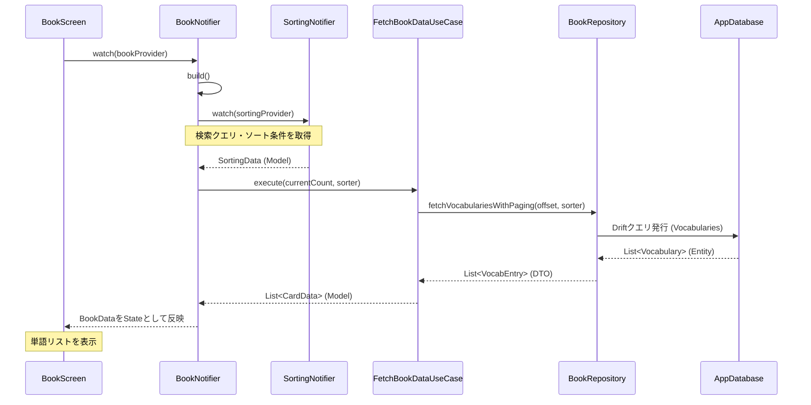
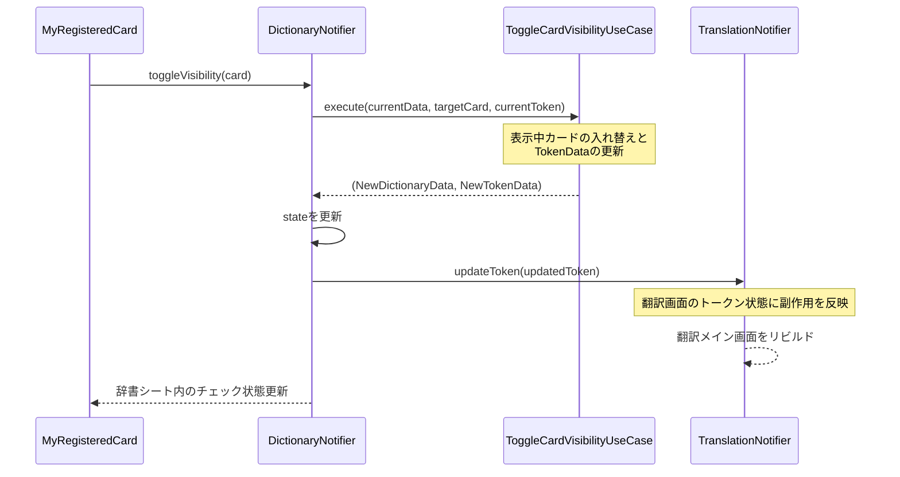

# 開発ガイド

## アプリ概要

英文の各単語の下に対応する日本語訳を併記して表示する、英語学習支援アプリ。
単語帳・内部辞書と連携し、単語単位で訳語の登録・表示切り替えができる。
詳しい開発経緯・コンセプトは[開発資料.md](./開発資料.md)を参照。

## アーキテクチャの概要

本プロジェクトはクリーンアーキテクチャに基づいた設計を行った。
ただし例外として、Providerは各`repository_abstract/`・`usecase/`ファイル内に定義している。

### 各レイヤーの責務

`presentation/`・`domain/`・`data/` の3レイヤーで構成されている。

- **Presentation層** (pages / view model): UIウィジェットとNotifier。ユーザー操作の受付と画面描画のみを担う。
- **Domain層** (use case / entity / repository): ビジネスロジック、データ定義、Repositoryのインターフェース定義。外部実装に依存しない。
- **Data層** (repository impl / mapper / DB): Repositoryの実装、DBとドメインエンティティ間の変換、Driftの定義。

なお、英文のトークン化・差分翻訳ロジック（`LocalTextProcessor`）は、Driftに直接依存しないため実質的にはドメインロジックに近いが、アプリ外部に切り離せるようにする意味合いで、ファイルは`data/`に置いている。

### 依存方向のルール

```
Presentation → Domain ← Data
```

- Presentationは、DomainのUseCaseとEntityに依存する。
- Domainは、PresentationにもDataにも依存しない。
- Dataは、DomainのRepositoryAbstractを実装し、Entityを返す。

### 処理方向のルール


【制約】状態の競合回避のため

- 他Notifierのプロパティは、Notifierのbuild関数でしか取得できない。
- Notifierのメソッドでは、他のNotifierのメソッドは1度しか呼び出すことはできない。

【フロー例】単語帳リスト画面の初期ロード



【フロー例】辞書シートにおける訳語の表示切り替え



## 画面・UI構成

### 全画面共通要素（`root/`）

- `EnglishLearningApp`（`routing.dart`）: GoRouterのルート定義。`ShellRoute`でボトムナビ画面（`/translate`・`/words`）を共通化し、`/registration`・`/setting`・`/help`は独立ルートとして遷移する。
- `CommonScreen`（`common_screen.dart`）: `bottomNavIndexProvider`（`bottom_index.dart`）を監視し、AppBarタイトルの切り替え、`MyDrawer`の表示、`BottomNavigationBar`によるページ遷移を担う共通Scaffold。
- `MyDrawer`（`drawer.dart`）: 保存済み英文一覧（`MyTile`）、設定・ヘルプへの導線を持つサイドメニュー。

### 翻訳モード画面（`pages/translation/`）

`TranslationModePage`が以下を縦に並べる。

- `MyTextField`: 複数行の英文入力欄。入力の都度`updateOriginalText`を呼び差分翻訳をスロットリング付きでトリガーする。
- `MyTranslateFab`・`MyBookmarkFab`: 手動で全体を再翻訳するボタンと、現在の翻訳状態を英文履歴として保存するボタン。
- `MyBlockField` → `WordBlock`: `Wrap`で単語ブロックを並べ、ピリオド直後に改行を挿入する。各`WordBlock`は英単語（上段）と訳語（下段、`nowShow`がfalseなら`-`）を表示し、タップで辞書機能シート（`VocabularyInputSheet`）をモーダル表示する。

### 辞書機能シート（`pages/dictionary/`）

- `VocabularyInputSheet`: 選択中トークンの英単語を見出しに、現在表示中のカード・単語帳候補（`RegisteredCared`）・内部辞書候補（`DictionaryCard`）を順に並べる。末尾の「オリジナルを登録」から登録画面へ遷移できる。
- `RegisteredCared`: 単語帳由来のカード。目のアイコンで表示/非表示切り替え（`DictionaryNotifier.toggleVisibility`）、本のアイコンで登録画面へ編集として遷移。
- `DictionaryCard`: 内部辞書由来のカード。本のアイコンで登録画面へ新規登録として遷移。

### 登録画面（`pages/register/`）

`EntryScreen`が以下のカードをまとめる。

- `EnglishCard`・`TranslationCard`・`MemoCard`: 英単語・訳語・メモの入力欄。
- `VisibilitySwitchCard`: 訳の表示可否を切り替えるアイコンボタン。
- `FooterBar`: 保存・キャンセル・削除ボタン。既存エントリ編集時のみ削除ボタンが表示される。

### 単語帳モード画面（`pages/wordbook/`）

`MyBookScreen`が`SliverAppBar`に検索バー（`MySearchBar`）・ソートドロップダウン（`MySortDropdownMenu`）・ソート順ボタン（`MySortOrderButton`）を内包し、本体は`MyBookCard`のリストを`SliverList`で表示する。`useEffect`によるスクロール監視とThrottleで無限スクロールを実現し、右下FABから新規登録（`EntryScreen`）へ遷移する。

## 主要ロジック

### テキスト処理・トークン化

`LocalTextProcessor._tokenizeText`が正規表現 `(\w+-\w+|\w+'\w+|\w+|[^\w\s]+|\s+)` で英文を「ハイフン語・アポストロフィ語・単語・句読点・空白」に分割し、空白のみのトークンを除外して`TokenData`の初期リストを生成する。

### 全体翻訳・差分翻訳

`ProcessTranslationUseCase`が`isFullScan`フラグでこの2つを使い分け、`TranslationNotifier`が入力変更時は差分翻訳（10msスロットル）、手動翻訳ボタン押下時は全体翻訳を呼び出す。

- `fullTranslation`: トークン化 → 単語トークンの`lookup_key`（小文字化した`showWord`）を集約 → `TranslationRepository.fetchTranslationsBatch`で一括検索 → 同じキーに複数件ある場合は`isShow: true`のものを優先してMap化 → 各トークンの`id`・`vocabId`・`nowShow`を更新して返す。
- `partTranslation`: 新旧トークン列の`showWord`を`diffutil_dart`で比較し、挿入・削除・変更・移動の差分を取得 → 影響を受けたインデックスのみ`fetchTranslationsBatch`で再検索 → 該当トークンのみ`id`・`vocabId`・`nowShow`を更新し、他は据え置く。

### 訳語の表示/非表示（排他制御）

`LocalRegisterRepository._setAllOthersHidden`が、`isShow: true`で新規登録・更新する際に同じ英単語を持つ他の全エントリの`isHidden`をtrueに更新する。これにより1単語に対して`isShow: true`のエントリは常に1件以下になる。辞書シートからの表示切り替え（`ToggleCardVisibilityUseCase`）も同様に、選択中カードとリスト内カードを入れ替えることで表示中の訳語を1件に保つ。

## 永続化データの定義

### 単語帳テーブル（Vocabularies）

| フィールド名        | 型       | 説明                                                                      |
| :------------------ | :------- | :------------------------------------------------------------------------ |
| id                  | integer  | 主キー、自動インクリメント                                                |
| englishWord         | text     | 英単語（小文字で保存）                                                    |
| japaneseTranslation | text     | 日本語訳                                                                  |
| isHidden            | boolean  | true のとき翻訳に使用しない（ドメイン層では `isShow` として反転して扱う） |
| memo                | text     | ユーザーメモ                                                              |
| createdAt           | dateTime | 登録日時                                                                  |
| updatedAt           | dateTime | 更新日時                                                                  |

> **排他制御**: `isHidden=false`（表示する）で登録・更新する際、同じ英単語の他の全エントリを `isHidden=true` に更新する。これにより1単語に対して表示される訳語が常に1件以下になる。ロジックは`repository_impl/`内で行う。

### 内部辞書テーブル（InternalDictionaries）

| フィールド名 | 型      | 説明                           |
| :----------- | :------ | :----------------------------- |
| id           | integer | 主キー                         |
| key          | text    | 検索用キー（小文字のみ）       |
| word         | text    | 英単語（表示用、大小文字混合） |
| mean         | text    | 日本語訳                       |
| memo         | text    | メモ（nullable）               |

### 英文履歴テーブル（EnglishTexts）

| フィールド名    | 型       | 説明                                                 |
| :-------------- | :------- | :--------------------------------------------------- |
| id              | integer  | 主キー、自動インクリメント                           |
| originalText    | text     | 元の英文全体                                         |
| parsedWordsJson | text     | `TokenData` のリストをJSON形式でシリアライズしたもの |
| createdAt       | dateTime | 保存日時                                             |
| updatedAt       | dateTime | 更新日時                                             |

`parsedWordsJson`の内部構造は`TokenData.toJson()`の配列で、以下の形式で保存される。

```json
[
  {
    "id": 0,
    "vocabId": 42,
    "showWord": "I",
    "nowShow": true,
    "translation": "私"
  },
  {
    "id": 1,
    "vocabId": -1,
    "showWord": "am",
    "nowShow": false,
    "translation": ""
  }
]
```

- `id`: トークンリスト内での位置インデックス（0始まりの連番）
- `vocabId`: 対応する単語帳エントリのID（未登録・内部辞書のみの場合は`-1`）
- `showWord`: 表示する文字列そのもの（大小文字混合、句読点も含む）
- `nowShow`: 訳語を翻訳画面に表示するかどうか
- `translation`: 表示する訳語文字列

英文履歴からの復元は`TokenMapper.fromJson`で行われ、`TileMapper.toTileDetail`が`parsedWordsJson`をデコードして`TileDetail`（`title`・`chain`）に変換する。

## テスト方針

### テスト対象レイヤー

以下の2レイヤーをテストした。

- **UseCase**（`test/usecase_test/`）: ビジネスロジックの正確性。Repositoryをmockして純粋なロジックを検証する。
- **RepositoryImpl**（`test/impl_tast/`）: DBアクセスを含む実装の検証。

AppDatabaseをmockまたはDriftのインメモリDBを使って動作を確認する。`LocalTextProcessor`のようにDBに直接依存しないクラスは、`TranslationRepository`をモック化した単体テストとして検証している。
簡略のため、Presentationレイヤー（Widget/Notifier）はテスト対象外とする。

### テストの分類

各テストケースを以下の3カテゴリで整理する。

- **正常系**: 想定通りのデータが渡された場合に正しい結果が返ること
- **境界値**: ページサイズぴったり・空リスト・文字列長の上限下限など、境界条件での動作
- **異常系**: Repositoryが例外を投げた場合のエラーハンドリング

### 使用ツール

- テストフレームワーク: `flutter_test`
- モックライブラリ: `mocktail`

## ディレクトリ構造

```
lib/
├── main.dart
├── presentation/
│   ├── view_models/
│   │   ├── book_notifier.dart
│   │   ├── bottom_index_notifier.dart
│   │   ├── dictionary_notifier.dart
│   │   ├── regidata_receiver.dart
│   │   ├── register_notifier.dart
│   │   ├── selected_token_notifier.dart
│   │   ├── sorting_notifier.dart
│   │   ├── tiles_notifier.dart
│   │   └── translation_notifier.dart
│   ├── pages/
│   │   ├── wordbook/
│   │   │   ├── book_screen.dart
│   │   │   ├── list/
│   │   │   │   ├── book_card.dart
│   │   │   │   ├── book_footer.dart
│   │   │   │   └── initial_error.dart
│   │   │   └── search/
│   │   │       ├── searchbar.dart
│   │   │       ├── sort_dropdown.dart
│   │   │       └── sort_order.dart
│   │   ├── drawer/
│   │   │   ├── drawer.dart
│   │   │   └── tile.dart
│   │   ├── translation/
│   │   │   ├── translation.dart
│   │   │   ├── text_field.dart
│   │   │   ├── block_field.dart
│   │   │   ├── word_block.dart
│   │   │   ├── translate_fab.dart
│   │   │   └── bookmark_fab.dart
│   │   ├── register/
│   │   │   ├── registration_page.dart
│   │   │   ├── regi_english_card.dart
│   │   │   ├── regi_translation_card.dart
│   │   │   ├── regi_memo_card.dart
│   │   │   ├── regi_visual_card.dart
│   │   │   └── regi_footer_bar.dart
│   │   └── dictionary/
│   │       ├── dictionary_sheet.dart
│   │       ├── registered_card.dart
│   │       └── dictionary_card.dart
│   └── root/
│       ├── common_screen.dart
│       └── routing.dart
├── domain/
│   ├── entity/
│   │   ├── value/
│   │   │   ├── base_status.dart
│   │   │   ├── sync_status.dart
│   │   │   ├── sort_field.dart
│   │   │   └── sort_order.dart
│   │   ├── model/
│   │   │   ├── book_data.dart
│   │   │   ├── card_data.dart
│   │   │   ├── dictionary_data.dart
│   │   │   ├── sorting_data.dart
│   │   │   ├── tiles_data.dart
│   │   │   ├── token_data.dart
│   │   │   └── translation_data.dart
│   │   └── carry/
│   │       ├── vocab_entry.dart
│   │       ├── tile_data.dart
│   │       └── tile_detail.dart
│   ├── usecase/
│   │   ├── fetch_bookdata_usecase.dart
│   │   ├── fetch_dictionarydata_usecase.dart
│   │   ├── toggle_card_visibility_usecase.dart
│   │   ├── process_translation_usecase.dart
│   │   ├── save_register_usecase.dart
│   │   ├── delete_register_usecase.dart
│   │   ├── fetch_tiles_all_usecase.dart
│   │   ├── fetch_tile_detail_usecase.dart
│   │   ├── save_tile_usecase.dart
│   │   └── delete_tile_usecase.dart
│   └── repository_abstract/
│       ├── book_repository.dart
│       ├── dictionary_repository.dart
│       ├── register_repository.dart
│       ├── token_chain_repository.dart
│       ├── tiles_repository.dart
│       └── translation_repository.dart
└── data/
    ├── repository_impl/
    │   ├── local_book_repository.dart
    │   ├── local_dictionary_repository.dart
    │   ├── local_register_repository.dart
    │   ├── local_token_chain_repository.dart
    │   ├── local_tiles_repository.dart
    │   └── local_translation_repository.dart
    ├── mapper/
    │   ├── vocab_mapper.dart
    │   ├── tile_mapper.dart
    │   └── token_mapper.dart
    └── db/
        ├── app_database.dart
        ├── app_database.g.dart
        ├── database_initializer.dart
        ├── _connection_native.dart
        └── _connection_web.dart
```

## 開発の現在地と今後

現在は主機能（翻訳・単語帳・内部辞書連携・英文履歴）の実装が完了し、Clean Architectureへの移行とテスト整備、公開に向けたドキュメント整備を進めている段階。今後の開発予定・こだわりの詳細は[開発資料.md](./開発資料.md)を参照。
