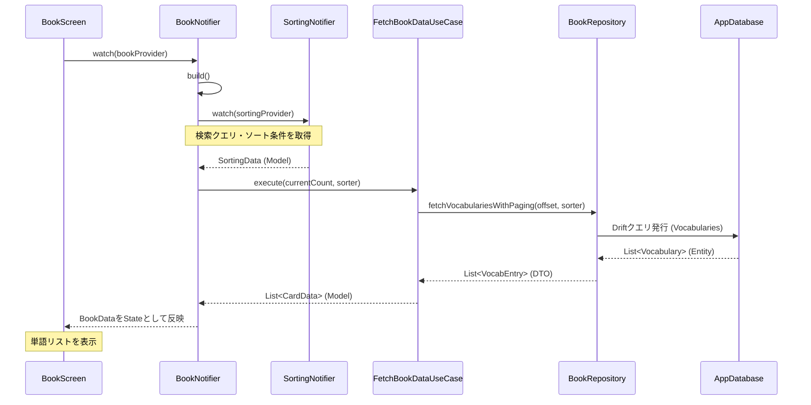
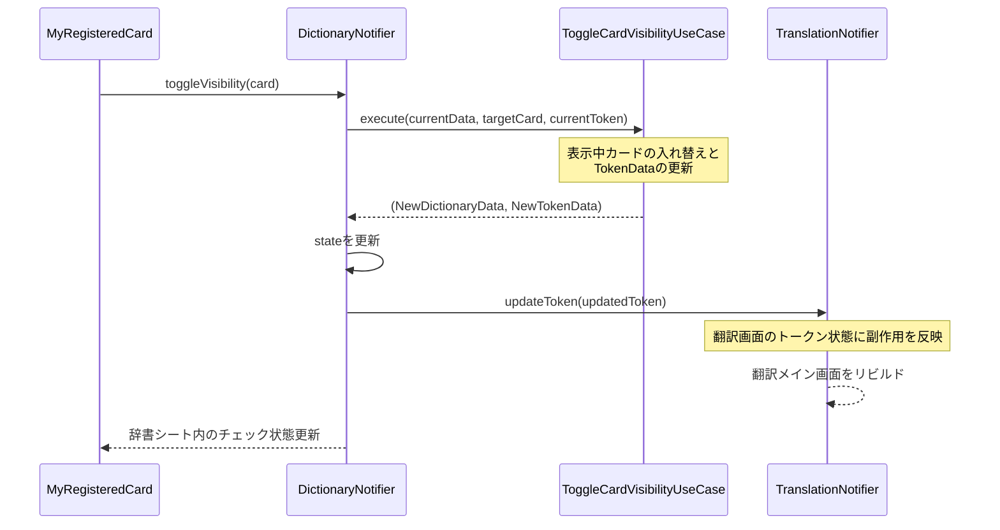
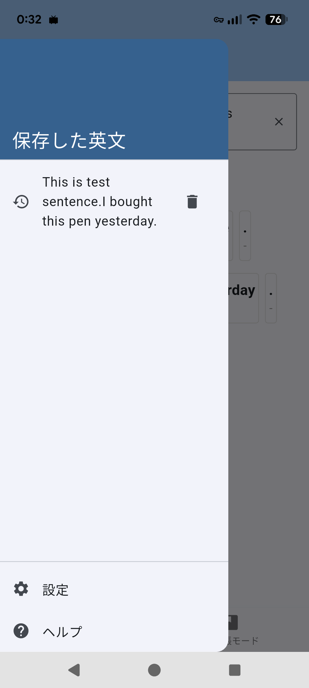
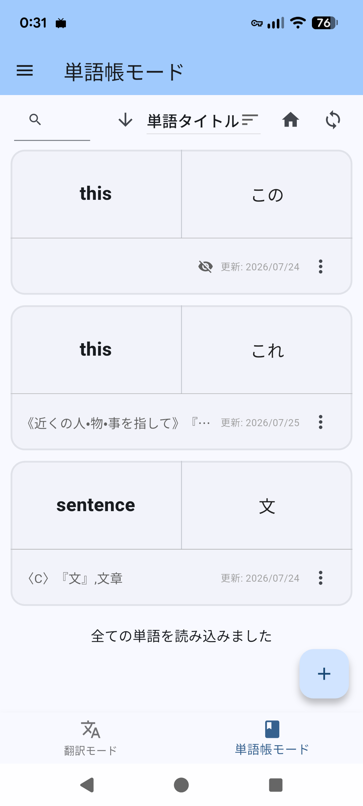
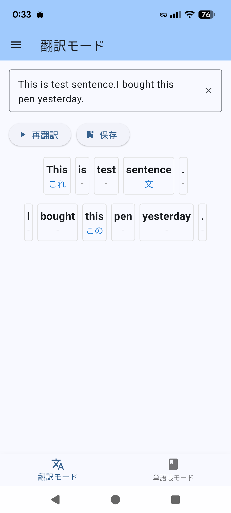
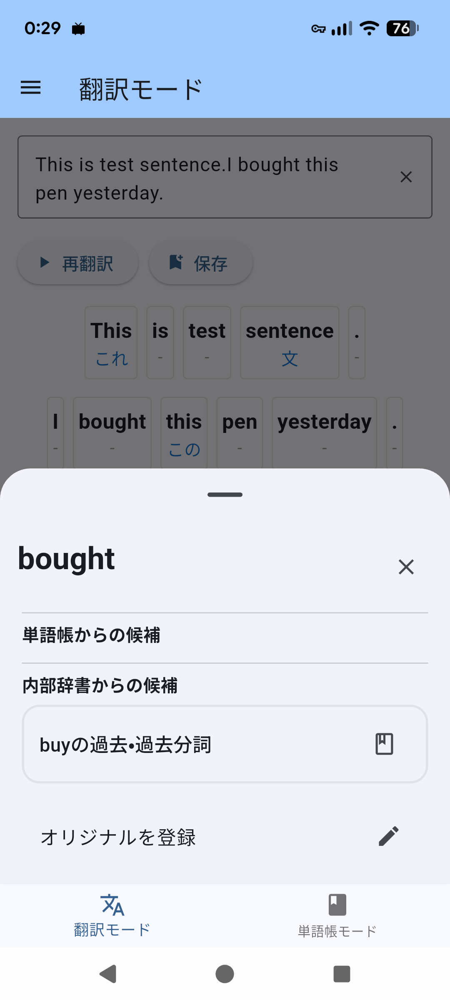
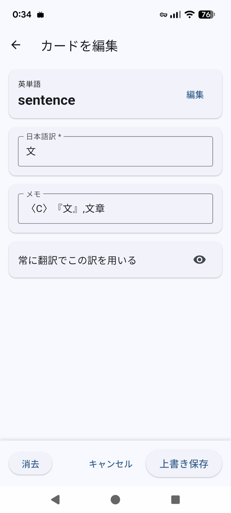

# 開発ガイド

## アプリ概要

英文の各単語の下に対応する日本語訳を併記して表示する、英語学習支援アプリ。
単語帳・内部辞書と連携し、単語単位で訳語の登録・表示切り替えができる。
詳しい開発経緯・コンセプトは[開発記.md](./開発記.md#開発経緯とコンセプト)を参照。

## 目次

- [開発ガイド](#開発ガイド)
  - [アプリ概要](#アプリ概要)
  - [目次](#目次)
  - [ディレクトリ構造](#ディレクトリ構造)
  - [使用技術](#使用技術)
  - [データ型の定義](#データ型の定義)
    - [value](#value)
    - [model](#model)
    - [carry](#carry)
  - [永続化データの定義](#永続化データの定義)
    - [単語帳テーブル（Vocabularies）](#単語帳テーブルvocabularies)
    - [内部辞書テーブル（InternalDictionaries）](#内部辞書テーブルinternaldictionaries)
    - [英文テーブル（EnglishTexts）](#英文テーブルenglishtexts)
    - [英文JSON（parsedWordsJson）](#英文jsonparsedwordsjson)
  - [アーキテクチャの概要](#アーキテクチャの概要)
    - [各レイヤーの責務](#各レイヤーの責務)
    - [依存方向のルール](#依存方向のルール)
    - [処理方向のルール](#処理方向のルール)
  - [画面・UI構成](#画面ui構成)
    - [画面遷移図](#画面遷移図)
    - [全画面共通要素](#全画面共通要素)
    - [サイドメニュー](#サイドメニュー)
    - [単語帳モード画面](#単語帳モード画面)
    - [翻訳モード画面](#翻訳モード画面)
    - [内部辞書シート](#内部辞書シート)
    - [登録画面](#登録画面)
  - [主要ロジック](#主要ロジック)
    - [トークン化](#トークン化)
    - [差分翻訳](#差分翻訳)
    - [全体翻訳](#全体翻訳)
    - [訳語の表示/非表示（排他制御）](#訳語の表示非表示排他制御)
  - [テスト方針](#テスト方針)
    - [テスト対象レイヤー](#テスト対象レイヤー)
    - [テストの分類](#テストの分類)
  - [今後の開発TODO](#今後の開発todo)

## ディレクトリ構造

```tree
lib/
├── main.dart           # データベースの初期設定
├── presentation/       # UI・状態管理
│   ├── view_models/   # 画面の状態（Notifier）
│   ├── pages/         # 画面・UIコンポーネント
│   │   ├── wordbook/      # 単語帳モード画面
│   │   ├── drawer/        # サイドメニュー（英文保存リスト）
│   │   ├── translation/   # 翻訳モード画面
│   │   ├── register/      # 登録画面
│   │   └── dictionary/    # 辞書機能シート
│   └── root/          # 共通画面・ルーティング
├── domain/                     # ビジネスロジック
│   ├── entity/                # データ構造（Model / Value Object）
│   ├── usecase/               # アプリのユースケース
│   └── repository_abstract/   # リポジトリの抽象クラス
└── data/                  # DBアクセス・データ変換
    ├── repository_impl/   # リポジトリの実装
    ├── mapper/            # DBデータとEntityの相互変換
    └── db/                # データベース（DriftのローカルDB接続設定）

test
├── usecase_test/   # usecaseのテストコード
└── impl_test/   # repository_implのテストコード
```

## 使用技術

本アプリで使用している主なライブラリと、その役割を以下に示す。選定理由や比較検討の経緯は[開発記.md](./開発記.md)を参照。

| ライブラリ | 役割 |
| :--- | :--- |
| `flutter_riverpod` / `hooks_riverpod` | 状態管理。画面の状態は`Notifier`/`AsyncNotifier`で管理し、Providerを通じて依存注入を行う |
| `flutter_hooks` | スクロール監視などの`useEffect`に使用 |
| `go_router` | 画面遷移（ルーティング）の定義・管理 |
| `drift` / `drift_flutter` / `sqlite3_flutter_libs` | ローカルDB（SQLite）のORM。型安全なクエリとコード生成 |
| `diffutil_dart` | 差分翻訳における、英文の差分計算 |
| `just_throttle_it` | 差分翻訳をトリガーする際の入力スロットリング |
| `path_provider` / `path` | ローカルDBファイルの保存先パス解決 |
| `flutter_test` | テストフレームワーク |
| `mocktail` | ユニットテストにおけるRepositoryのモック化 |

## データ型の定義

<details>
<summary>クリックして展開</summary>

### value

ソート順やステータスなど。
システム内であらかじめ決まった選択肢や概念そのものを定義している。

---

`base_status.dart` | `Based`

| フィールド名 | 型 | 説明 |
| :--- | :--- | :--- |
| vocabularies | enum | 単語帳DB由来 |
| dictionary | enum | 内部辞書DB由来 |
| init | enum | 初期値（未登録） |

---

`sync_status.dart` | `SyncStatus`

| フィールド名 | 型 | 説明 |
| :--- | :--- | :--- |
| normal | enum | 通常状態 |
| load | enum | 途中ロード中 |
| err | enum | 途中エラー |

---

`sort_field.dart` | `SortField`

| フィールド名 | 型 | 説明 |
| :--- | :--- | :--- |
| createdAt | enum | 作成日時でソート |
| englishWord | enum | 英単語でソート |

---

`sort_order.dart` | `SortOrder`

| フィールド名 | 型 | 説明 |
| :--- | :--- | :--- |
| asc | enum | 昇順 |
| desc | enum | 降順 |

### model

画面（UI）に何を表示するか、スクロールがどこまで進んだかなど。
現在の状態、UIに必要な情報を保持する。

---

`book_data.dart` | `BookData`

| フィールド名 | 型 | 説明 |
| :--- | :--- | :--- |
| pageSize | int | 1ページあたりの取得件数 |
| cards | List\<CardData> | ロード済み単語カードのリスト |
| tailStatus | SyncStatus | リスト下部に表示すべき状態 |
| isDataEnd | bool | getter: cards.length < pageSize でデータ終端かを判定 |

---

`card_data.dart` | `CardData`

| フィールド名 | 型 | 説明 |
| :--- | :--- | :--- |
| nowShow | bool | 現在この訳語が翻訳に表示されているか |
| vocab | VocabEntry | 単語帳エントリ本体 |

---

`dictionary_data.dart` | `DictionaryData`

| フィールド名 | 型 | 説明 |
| :--- | :--- | :--- |
| showCard | CardData? | 現在選択・表示中のカード（null = 非選択） |
| vocabularyCards | List\<CardData> | 単語帳からの候補リスト（未選択分） |
| dictionaryCards | List\<CardData> | 内部辞書からの候補リスト |

---

`sorting_data.dart` | `SortingData`

| フィールド名 | 型 | 説明 |
| :--- | :--- | :--- |
| field | SortField | ソート対象カラム |
| order | SortOrder | ソート順 |
| searchWord | String | 確定済み検索文字列 |
| typingWord | String | 入力中の検索文字列（未確定） |
| pageSize | int | 1ページあたりの取得件数（既定値20） |

---

`tiles_data.dart` | `TilesData`

| フィールド名 | 型 | 説明 |
| :--- | :--- | :--- |
| list | List\<TileData> | 保存済み英文履歴リスト |

---

`token_data.dart` | `TokenData`

| フィールド名 | 型 | 説明 |
| :--- | :--- | :--- |
| id | int | リスト内の位置インデックス |
| vocabId | int | 対応する単語帳エントリID（未登録は -1） |
| showWord | String | 表示する文字列（大小文字混合） |
| nowShow | bool | 訳語を翻訳画面に表示するか |
| translation | String | 表示する訳語 |
| isWord | bool | getter: 単語か句読点かを正規表現で判定 |
| word | String | getter: showWord.toLowerCase()（DB検索キー） |

---

`translation_data.dart` | `TranslationData`

| フィールド名 | 型 | 説明 |
| :--- | :--- | :--- |
| originalText | String | 入力された英文全体 |
| tokens | List\<TokenData> | トークン化・訳語割り当て済みのリスト |

### carry

データベース（外部）から取ってきた生データを、アプリケーション内部で持ち運んだり受け渡したりするための中継役（=DTO）。

`vocab_entry.dart` | `VocabEntry`

| フィールド名 | 型 | 説明 |
| :--- | :--- | :--- |
| id | int | 単語帳DBのID（内部辞書由来は -1） |
| word | String | 英単語（小文字） |
| translation | String | 日本語訳 |
| isShow | bool | 翻訳に使用するか（DBのisHiddenの反転） |
| memo | String | メモ |
| createdAt | DateTime | 登録日時 |
| updatedAt | DateTime | 更新日時 |
| based | Based | 出典元 |

---

`token_entry.dart` | `TokenEntry`

| フィールド名 | 型 | 説明 |
| :--- | :--- | :--- |
| vocabId | int | 対応する単語帳エントリID |
| showWord | String | 英単語（表示用） |
| translation | String | 日本語訳 |
| isShow | bool | 翻訳に表示するか |

---

`tile_data.dart` | `TileData`

| フィールド名 | 型 | 説明 |
| :--- | :--- | :--- |
| id | int | 英文履歴DBのID |
| text | String | 英文テキスト（履歴リスト表示用） |

---

`tile_detail.dart` | `TileDetail`

| フィールド名 | 型 | 説明 |
| :--- | :--- | :--- |
| title | String | 英文テキスト |
| chain | List\<TokenData> | 訳語割り当て済みトークンリスト（履歴からの復元用） |

</details>

## 永続化データの定義

<details>
<summary>クリックして展開</summary>

### 単語帳テーブル（Vocabularies）

| フィールド名 | 型 | 説明 |
| :--- | :--- | :--- |
| id | integer | 主キー、自動インクリメント |
| englishWord | text | 英単語（小文字で保存） |
| japaneseTranslation | text | 日本語訳 |
| isHidden | boolean | true のとき翻訳に使用しない（ドメイン層では `isShow` として反転して扱う） |
| memo | text | ユーザーメモ |
| createdAt | dateTime | 登録日時 |
| updatedAt | dateTime | 更新日時 |

### 内部辞書テーブル（InternalDictionaries）

| フィールド名 | 型 | 説明 |
| :--- | :--- | :--- |
| id | integer | 主キー |
| key | text | 検索用キー（小文字のみ） |
| word | text | 英単語（表示用、大小文字混合） |
| mean | text | 日本語訳 |
| memo | text | メモ（nullable） |

### 英文テーブル（EnglishTexts）

| フィールド名 | 型 | 説明 |
| :--- | :--- | :--- |
| id | integer | 主キー、自動インクリメント |
| originalText | text | 元の英文全体 |
| parsedWordsJson | text | `TokenData` のリストをJSON形式でシリアライズしたもの |
| createdAt | dateTime | 保存日時 |
| updatedAt | dateTime | 更新日時 |

### 英文JSON（parsedWordsJson）

内部構造は`TokenData.toJson()`の配列で、以下の形式で保存される。
英文履歴からの復元は`TokenMapper.fromJson`で行われ、`TileMapper.toTileDetail`が`parsedWordsJson`をデコードして`TileDetail`（`title`・`chain`）に変換する。

```json
[
  {
    "id": 0,
    "vocabId": 42,
    "showWord": "I",
    "nowShow": true,
    "translation": "私"
  },
  {
    "id": 1,
    "vocabId": -1,
    "showWord": "am",
    "nowShow": false,
    "translation": ""
  }
]
```

- `id`: トークンリスト内での位置インデックス（0始まりの連番）
- `vocabId`: 対応する単語帳エントリのID（未登録・内部辞書のみの場合は`-1`）
- `showWord`: 表示する文字列そのもの（大小文字混合、句読点も含む）
- `nowShow`: 訳語を翻訳画面に表示するかどうか
- `translation`: 表示する訳語文字列

</details>

## アーキテクチャの概要

本プロジェクトはクリーンアーキテクチャに基づいた設計を行った。
ただし例外として、Providerは各`repository_abstract/`・`usecase/`ファイル内に定義している。

### 各レイヤーの責務

`presentation/`・`domain/`・`data/` の3レイヤーで構成されている。

- **Presentation層** (pages / view model): UIウィジェットとNotifier。ユーザー操作の受付と画面描画のみを担う。
- **Domain層** (use case / entity / repository): ビジネスロジック、データ定義、Repositoryのインターフェース定義。外部実装に依存しない。
- **Data層** (repository impl / mapper / DB): Repositoryの実装、DBとドメインエンティティ間の変換、Driftの定義。

なお、英文のトークン化・差分翻訳ロジック（`LocalTextProcessor`）は、Driftに直接依存しないため実質的にはドメインロジックに近いが、アプリ外部に切り離せるようにする意味合いで、ファイルは`data/`に置いている。

### 依存方向のルール

```
Presentation → Domain ← Data
```

- Presentationは、DomainのUseCaseとEntityに依存する。
- Domainは、PresentationにもDataにも依存しない。
- Dataは、DomainのRepositoryAbstractを実装し、Entityを返す。

### 処理方向のルール


【制約】状態の競合回避のため

- 他Notifierのプロパティは、Notifierのbuild関数でしか取得できない。
- Notifierのメソッドでは、他のNotifierのメソッドは1度しか呼び出すことはできない。

【フロー例】単語帳リスト画面の初期ロード



【フロー例】辞書シートにおける訳語の表示切り替え



## 画面・UI構成

### 画面遷移図


- `/translate`・`/words`は`ShellRoute`配下のボトムナビゲーションで切り替わる。
- `/registration`・`/setting`・`/help`は独立ルートへの`push`遷移（戻るボタンで前画面に戻る）。
- 辞書機能シートは独立ルートではなく、翻訳モード画面上のモーダル（`showModalBottomSheet`）として表示される。

### 全画面共通要素

`root/`に実装されている、全画面で共有される要素。

全ボトムナビ画面のルーティングと共通Scaffoldを提供する。

- **ルーティング定義**: `ShellRoute`でボトムナビ画面（`/words`・`/translate`）を共通化し、`/registration`・`/setting`・`/help`は独立ルートとして遷移する。
- **共通Scaffold**: 現在のボトムナビの選択状態を監視し、AppBarタイトルの切り替え、サイドメニューの表示、ボトムナビゲーションバーによる画面遷移を担う。

### サイドメニュー

`pages/drawer/`に実装されている。



翻訳・単語帳の両画面から共通で開けるサイドメニュー。

- **英文履歴一覧**: 保存済みの英文をタイル形式で縦に一覧表示する。タップすると該当の翻訳状態を復元して翻訳画面へ遷移する。
- **設定・ヘルプへの導線**: 設定画面・ヘルプ画面へ遷移するボタン。

### 単語帳モード画面

`pages/wordbook/`に実装されている。



登録済みの単語をカード形式で一覧・検索できる画面。

- **検索・並び替えヘッダー**: 検索バー、ソート条件のドロップダウン、昇順/降順の切り替えボタンをまとめた、スクロールに追従するヘッダー。
- **単語カードリスト**: 単語カードを縦に並べて表示する。
  - 本のアイコン: タップすると、そのエントリが編集対象として渡され、登録画面へ遷移する。
- **新規登録ボタン**: 右下に配置され、タップすると登録画面へ遷移する。

【スクロールによる機能】

- **無限スクロール**: リスト末尾に達すると、自動で次のページを読み込む。
- **Pull To Reflesh**: リスト最上部で上スクロールすると、リストを再取得する。

### 翻訳モード画面

`pages/translation/`に実装されている。



英文を入力すると、単語ごとに訳語を併記して表示するメイン画面。

- **英文入力欄**: 複数行の英文入力欄。入力の都度、差分翻訳をスロットリング付きでトリガーする。
- **翻訳・保存ボタン**: 手動で全体を再翻訳するボタンと、現在の翻訳状態を英文履歴として保存するボタン。
- **単語ブロック領域**: 単語ブロックを折り返しながら並べる領域。ピリオド直後には改行を挿入する。
  - 上段: 英単語を表示。
  - 下段: 訳語（非表示中は「-」）を表示。
  - タップ: 内部辞書シートをモーダルへ遷移。

### 内部辞書シート

`pages/dictionary/`に実装されている。



翻訳画面で単語ブロックをタップすると開くモーダルシート。選択中の単語に対応する候補を、以下の3グループに分けて縦に並べる。

- **表示中カード**: 現在翻訳画面に訳語を表示しているエントリを、存在する場合のみ1件表示する。
- **単語帳からの候補**: 同じ英単語を持つ、単語帳の他のエントリを列挙する。
  - 目のアイコン: タップすると、表示する訳語がこのカードに切り替わる。
  - 本のアイコン: タップすると、そのエントリが編集対象として渡され、登録画面へ遷移する。
- **内部辞書からの候補**: 内部辞書由来の候補を列挙する。単語帳未登録のため、表示切り替えはできず閲覧のみ。
  - 本のアイコン: タップすると、そのエントリが新規登録対象として渡され、訳やメモを維持したまま登録画面へ遷移する。
- **「オリジナルを登録」ボタン**: 選択中の単語を初期値として登録画面に新規登録できる。

### 登録画面

`pages/register/`に実装されている。



単語帳エントリの新規登録・編集を行う画面。

- **入力欄**: 英単語・訳語・メモの入力欄。
- **表示切り替えボタン**: 訳の表示可否を切り替えるアイコンボタン。
- **フッターボタン**: 保存・キャンセル・削除ボタン。既存エントリ編集時のみ削除ボタンが表示される。

## 主要ロジック

### トークン化

`local_text_processor.dart`の`LocalTextProcessor`が、入力された英文をトークン列に分割する。

```dart
List<TokenData> _tokenizeText({required String text})
```

1. 正規表現 `(\w+-\w+|\w+'\w+|\w+|[^\w\s]+|\s+)` により、ハイフン単語・アポストロフィ単語・単語・記号・空白のまとまりに分割する
2. 空白のみのトークンを除外する
3. 各断片を`TokenData`として初期リストに格納する

### 差分翻訳

`TranslationNotifier`は、テキスト入力時は差分翻訳（10msスロットル）、翻訳ボタン押下時は全体翻訳を呼び出す。両者は`ProcessTranslationUseCase`が`isFullScan`フラグで分岐させ、`LocalTextProcessor`の各メソッドに処理を委譲する。

差分翻訳は、変更のあった箇所だけを再翻訳することで、長文入力時の再検索コストを抑える設計になっている。

```dart
Future<List<TokenData>> partTranslation({
  required List<TokenData> nowTokens,
  required String newText,
})
```

1. 新しいテキストをトークン化する
2. 新旧トークン列から`showWord`のみを取り出したリストを作り、比較用のキーを揃える
3. `diffutil_dart`で、挿入・削除・変更・移動が発生したインデックスを検出する
4. 影響を受けたインデックスのうち、辞書検索が必要な単語を収集する
5. 該当インデックスのみ`fetchTranslationsBatch`でDB検索する
6. 同じ単語が複数件ヒットした場合は、登録済みかつ「表示設定（`isShow`）」が有効なものを優先する
7. 影響を受けたトークンのみ`id`・`vocabId`・`nowShow`を更新し、それ以外は据え置くことで、新しいトークン列に訳語を割り当てる

### 全体翻訳

全体翻訳は、差分計算を行わず全トークンを一括で処理する分、実装がシンプルになっている。

```dart
Future<List<TokenData>> fullTranslation({required String text})
```

1. テキストをトークン化する
2. 単語トークンから、検索用キー（`lookup_key`: `showWord`を小文字化したもの）を収集する
3. `fetchTranslationsBatch`で一括検索する
4. 同じキーに複数件ヒットする場合は、`isShow: true`のものを優先してMap化する
5. 各トークンの`id`・`vocabId`・`nowShow`を更新して返す

### 訳語の表示/非表示（排他制御）

このアプリでは「1つの英単語につき、翻訳画面に表示される訳語は常に1件以下」というルールを、2つの場面で別々の仕組みにより維持している。

【単語帳への登録・更新時】

登録画面で訳語を「表示する（`isShow: true`）」に設定して保存すると、DB更新の直前に`local_register_repository.dart`の`LocalRegisterRepository._setAllOthersHidden`が実行される。

```dart
Future<int> _setAllOthersHidden({required String word})
```

1. 保存するエントリが`isShow: true`の場合のみ実行する
2. 同じ英単語を持つ他の全エントリの`isHidden`をtrueに更新する

【翻訳画面での表示切り替え時】

単語ブロックをタップして開く辞書シート上でカードを選択すると、`toggle_card_visibility_usecase.dart`の`ToggleCardVisibilityUseCase.execute`が、選択中カード（`targetCard`）とリスト内のカード（`DictionaryData`）を入れ替える。

```dart
(DictionaryData, TokenData) execute({
  required DictionaryData currentData,
  required CardData targetCard,
  required TokenData currentToken,
})
```

1. 現在表示中のカード（`showCard`）が選択された場合は、そのカードの`nowShow`をfalseにする
2. リスト内のカードが選択された場合（新たに表示する場合）は、以下を行う
   1. 対象カードがリスト内のどこにあるかを特定する
   2. リストから除去する
   3. 直前まで表示していたカードが存在すれば、リストに戻す
   4. 対象カードを新たな`showCard`として設定する

## テスト方針

### テスト対象レイヤー

以下の2レイヤーをテストした。

- **UseCase**（`test/usecase_test/`）: ビジネスロジックの正確性。
  - Repositoryをmockして純粋なロジックを検証する。
- **RepositoryImpl**（`test/impl_tast/`）: DBアクセスを含む実装の検証。
  - AppDatabaseをmockまたはDriftのインメモリDBを使って動作を確認する
  - `LocalTextProcessor`のようにDBに直接依存しないクラスは、`TranslationRepository`をモック化した単体テストとして検証している。

簡略のため、Presentationレイヤー（Widget/Notifier）はテスト対象外とする。

### テストの分類

各テストケースを以下の3カテゴリで整理する。

- **正常系**: 想定通りのデータが渡された場合に正しい結果が返ること
- **境界値**: ページサイズぴったり・空リスト・文字列長の上限下限など、境界条件での動作
- **異常系**: Repositoryが例外を投げた場合のエラーハンドリング

## 今後の開発TODO

- クリップボードから翻訳フィールドに貼り付けるボタン
- 「Mr.Arex」と打ったとき、`.` で改行しないようにする
- 三人称単数現在形の「s」や過去形の「ed」, 進行形の「ing」が付いても、原型で辞書検索する
- 単語帳のカードで、日本語訳を隠す機能
- 設定画面でカードの表示の種類を選べるようにする
- 色彩設定のハードコード脱却
- ダークモード導入
- バックエンド・ロジックを外部で行わせる、APIやサーバー関連の学習
- 画像から文章を抽出し翻訳フィールドに投入する、組み込み画像処理
- 文脈に合わせた日本語訳の推薦する、アルゴリズム開発
