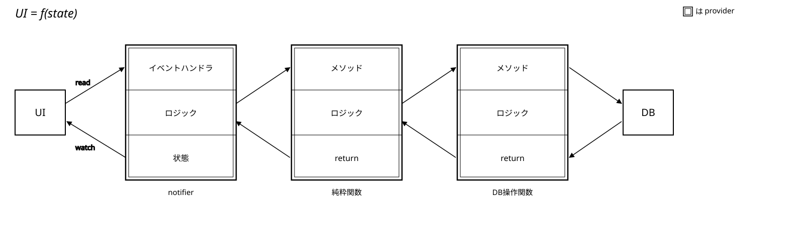

# edb 開発資料

## 開発経緯とコンセプト

既存の翻訳アプリは、英文全体を日本語の文に変換します。
そのため、学生が英語を学ぶ上で重要な「単語の暗記」や「文法・文構造の理解」の機会を飛ばしてしまう可能性があります。

本アプリは、英文の各英単語の下に、対応する日本語を併記して表示します。
これにより、英単語と日本語の対応関係を単語レベルで視覚的に理解できます。
また、ネイティブスピーカーのように左から右へ英文を読み進める訓練になり、
返り読みの減少や、英語と日本語の語順・文構造の違いをスムーズに習得することが期待できます。

特定の英文に対し単語ごとに日本語訳をその下に表示するアプリは、
web及びGoogle Play Storeで見つからなかったため、自作しました。

## 技術選定

### なぜFlutterか

本プロジェクトでは、モバイルアプリ（Android）および将来的なWeb展開を見据え、マルチプラットフォーム開発フレームワークとしてFlutter（Dart）を採用しました。

本アプリは学生をメインターゲットとして想定しています。
なので、通学時間や隙間時間のような日常のわずかな時間で手軽に使えるようにするため、PC向けではなく、モバイルで動作できる必要が大前提としてありました。

また、私は普段、UbuntuとWindowsという物理的に異なる2台のマシンを使っているため、どちらのPCからでも同様な開発体験をしたいという要望がありました。
そのため、OSを問わず同一のソースコードから、一貫した挙動とUIをシミュレート・確認できる必要がありました。

この要件を満たすクロスプラットフォーム開発用の言語・フレームワークとして、React Native、Kotlin Multiplatform (KMP)、Flutterの3つを比較・検討しました。

React Nativeは、JavaScriptを用いて開発を行います。
しかし、JavaScriptは動的型付けに起因するランタイムエラーのリスクや、非同期処理の記述が複雑化しやすいという課題を感じていました。
軽量で、独立したネイティブパフォーマンスを重視したかったため、JavaScriptエコシステムに依存するReact Nativeは除外しました。

KMPは、ビジネスロジックを共通化しつつ、UI描画は各プラットフォームのネイティブ言語・フレームワークで個別に実装するアプローチが主流です。
しかし、本アプリの最終的なビルドターゲットはAndroidであり、開発機であるWindowsやLinux向けにまでUIを個別実装するのは、目的と手段が入れ替わっていると感じました。
また、KMPの大きな強みはカメラやBluetoothなど、モバイル特有のネイティブAPIをプラットフォームごとに呼び分けられる点にありますが、本アプリはそうした機能をほとんど必要としません。
この点でKMPを採用するメリットを見出せなかったため、採用を見送りました。

最終的にDart/Flutterを採用した理由は以下の2点です。

開発言語であるDartは、JavaScriptのような文法で書ける快適性を持ちながら、静的型付けによる堅牢な開発が可能です。
そして、私がJavaScriptの欠点だと考える、中途半端なオブジェクト指向、多様すぎる非同期処理の記法、重厚なWeb技術のスタック（HTML/CSS/JS）から距離を置くことができます。

Flutterは、ブラウザやOSのネイティブUIコンポーネントに依存せず、独自のグラフィックエンジンによって直接画面を描画します。
これにより、OSやブラウザの違いによる挙動の差異がなくなり、どの環境でも一貫したUIを描画できる点が、私の開発要件と完全に一致しました。

実際に導入してみて、宣言的UI（Widget）と型安全なコードで描画とロジックをシームレスに記述できること、どのOSでも一貫したUIを描画できること、そしてHot Reloadによって迅速な試行錯誤ができること、の魅力を実感したため、Flutterで開発してよかったと感じました。

### なぜデータベースにdriftを使ったか

Flutterでローカルにデータ保存を行う場合、一般的にsqfliteかDrift(旧Moor)が選択肢です。
今回の開発では、Windowsでの開発はWebをコンパイルターゲットとしているため、DBライブラリにもWeb対応が必須でした。

初めてデータベースを実装したときは、sqfliteを使っていました（アプリver.0.4.0）。
sqfliteは単体ではWebで動作しないので、sqflite_common_ffi_webと組み合わせて対応する予定でした。
しかし、初回起動時に内部辞書用のsqliteデータをデータベースに流し込むという処理が実現できませんでした。

これを回避するため、sqfliteのコードを全て削除し、driftに移行しました（アプリver.0.4.1）。

## 設計

### データ構造

一言で「英単語」といっても、翻訳・内部辞書・単語帳・英文、場所が異なれば保持すべき情報は異なります。
しかし、「英単語」に全ての場所で使える万能なデータ構造にすると、保存ファイルが大きくなったり、メモリ消費量が増え、計算処理が重くなってしまいます。

本プロジェクトでは、「英単語」を`TokenEntry`と`VocabEntry`の2種類で管理しています（[参照](./人間向け技術資料.md#carry)）。
`TokenEntry`は、翻訳結果の表示に用います。
翻訳に長文が入力された際、インスタンスが増加しても描画に必要なメモリの消費が小さくするため、英文保存を行っても記憶容量を小さくするために、復元に必要十分な最小限のデータを保持します。
`VocabEntry`は、データベースにある単語が保持すべき情報の全てを有しています。
描画で作成されるインスタンスは多くても数十程度を想定しているため、大きなデータ構造にしました。
インスタンスを使いまわしてDBアクセスを抑えたり、適度にデータ破棄が起こるようルーティングを工夫しています。

ある処理で・ある状態で単語が持つべきデータは何か整理することで、計算資源を最適化しています。

### アーキテクチャ

もともと`UI=f(state)`に則って、状態を提供するnotifier、状態の型定義をするdata、状態を元に描画するpresentationの3層に分けてコーディングしていました（ver.0.9.2まで）。
しかし、開発が進むに連れて、notifierが持つ役割が増え、状態同士の非同期処理や依存関係および副作用等が複雑になり、クラス内の可読性が次第に悪くなっていきました。

そこで、アプリ全体を俯瞰し、どのようにしたらキレイなデータフローになるか、一度立ち止まって考えてみました。

紙に書き出し、上の図を画像検索したところ、ドメイン駆動アーキテクチャ（DDD）やクリーンアーキテクチャに類似していることが分かりました。
依存方向と処理方向では矢印が逆転する場所が存在し、その部分で複雑さが増していることに気づき、アーキテクチャ設計の重要さに驚きました。
DDDはドメイン層を外部の変更から独立させることが強調されがちですが、自分としては、ファイルやクラスを整理する手法として非常に優れていると感じました。

本アプリはver.1.0.0以降、厳密なクリーンアーキテクチャではないものの、アプリ専用にアレンジし、クリーンアーキテクチャに十分類似した構造を持っています。
大幅なコードの改変でしたが、修正すべき箇所の特定が容易になり、変更してよかったと感じました。

現在の構造の詳細は人間向け技術資料.mdの[アーキテクチャの概要](./人間向け技術資料.md#アーキテクチャの概要)を参照してください。

## コーディングでのこだわり

### 単語帳画面

検索・ソート条件（[sortingProvider](./LLM向け技術資料.md#sortingnotifier--sorting_notifierdart)）と、一覧・ページネーション（[bookProvider](./LLM向け技術資料.md#booknotifier--book_notifierdart)）は、
対等な関係にすると互いの状態変化が波及し合い、収拾がつかなくなります。

そこで、bookProviderがsortingProviderをwatchする一方向の依存にまとめました。
検索確定やソート変更はsortingProviderの更新のみを行い、bookProviderはそれを検知して自動的に一覧を作り直します。
また、Pull-to-Refreshと無限スクロールは、このbookProviderに対する「全件作り直し」と「次ページ追加」という2種類のトリガーとして位置づけることで、状態同士が直接依存し合う複雑さを解消しました。

### 部分翻訳処理

翻訳画面のUI表示ロジックでは、Riverpodのselectを用いて各単語ブロックが自身のTokenの値のみを監視するようにし、変更されたTokenの再描画のみが発生するようにしています（[tokenProvider](../lib/presentation/view_models/translation_notifier.dart)）。

翻訳ロジック側も、変更されたTokenEntryのみをピンポイントで再計算する設計にしており、変更に関与しない単語は据え置かれます（[LocalTextProcessor.partTranslation()](../lib/data/repository_impl/local_text_processor.dart)）。
実際の計算量削減を計測したわけではありませんが、[設計上](./人間向け技術資料.md#差分翻訳)、文章量に比例して計算コストが増える一般的な全文再翻訳方式と比べ、計算量は小さくなります。

### 訳の表示非表示

英単語を覚えたら翻訳中の表示を消し、やっぱ無理となったらすぐ復帰できるよう、訳の表示非表示をトグルさせる機能がほしいと考えていました。
この仕様を許すとデータベースの主キーを英単語にできないため、単語帳エントリにはサロゲートキー（整数id）を割り当てています。

その上で「1つの英単語につき表示される訳語は常に1件以下」というルールを、ロジック側で排他制御して維持しています（[アルゴリズム](人間向け技術資料.md#訳語の表示非表示排他制御)）。
単語帳への登録・更新時は、保存するエントリが表示設定の場合、同じ英単語を持つ他の全エントリを非表示に更新します。
翻訳画面上の内部辞書シートはモーダルとして翻訳状態と同期しており、シート上でカードを切り替えると、選択中カードと対象カードの表示状態を入れ替えることで、即座に翻訳画面の表示にも反映されます。

## 今後の開発TODO

[人間向け技術資料.md](./人間向け技術資料.md#今後の開発todo)と同様です。

- クリップボードから翻訳フィールドに貼り付けるボタン
- 「Mr.Arex」と打ったとき、`.` で改行しないようにする
- 三人称単数現在形の「s」や過去形の「ed」, 進行形の「ing」が付いても、原型で辞書検索する
- 単語帳のカードで、日本語訳を隠す機能
- 設定画面でカードの表示の種類を選べるようにする
- 色彩設定のハードコード脱却
- ダークモード導入
- バックエンド・ロジックを外部で行わせる、APIやサーバー関連の学習
- 画像から文章を抽出し翻訳フィールドに投入する、組み込み画像処理
- 文脈に合わせた日本語訳の推薦する、アルゴリズム開発
